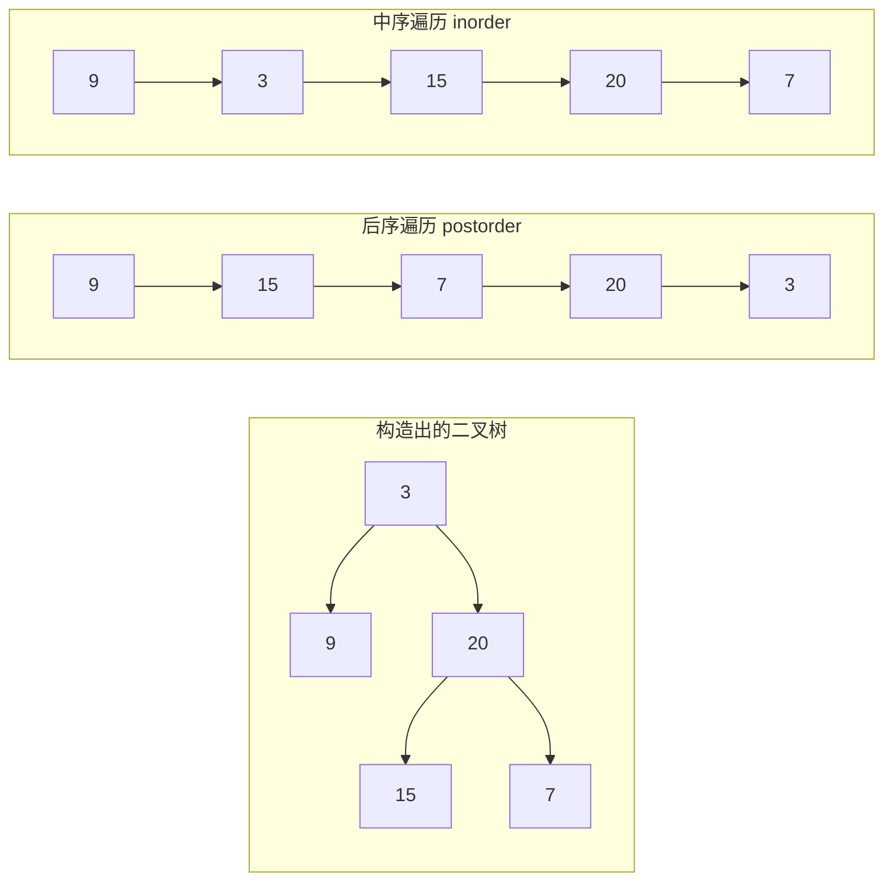
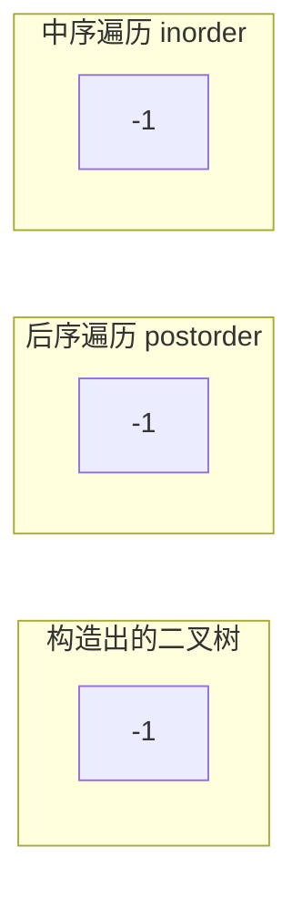

+++
title = "LC 106：从中序与后序遍历构造二叉树"
date = "2025-12-23T10:30:00+08:00"
tags = ["二叉树", "递归", "分治", "遍历"]
categories = ["算法"]
collections = ["算法"]

draft = false
weight = 106
+++

## 题目描述

给定两个整数数组 `inorder` 和 `postorder`，其中：

- `inorder` 是一棵二叉树的 **中序遍历**
- `postorder` 是同一棵二叉树的 **后序遍历**

请你构造并返回这棵二叉树。

---

## 示例

### 示例 1



### 示例 2



---

> [!tip]
> - `1 <= inorder.length <= 3000`
>
> - `postorder.length == inorder.length`
>
> - `inorder` 和 `postorder` 由 **不同的值** 组成
>
> - `postorder` 中每一个值都在 `inorder` 中
>
> - 题目保证输入一定对应一棵合法的二叉树

---

## 解题思路

本题是二叉树构造问题的经典题型，关键在于理解 **中序遍历** 与 **后序遍历** 的性质，并利用递归进行分治。

---

### 遍历序列的性质

#### 后序遍历（Postorder）

遍历顺序为：


因此，**后序遍历序列的最后一个元素一定是当前子树的根节点**。

---

#### 中序遍历（Inorder）

遍历顺序为：


根节点在中序遍历中的位置，可以将序列分为左右两部分：

- 左侧为左子树
- 右侧为右子树

---

### 递归构造思路

对于当前的 `inorder` 和 `postorder` 区间：

1. 取 `postorder` 的最后一个元素作为根节点
2. 在 `inorder` 中找到该根节点的位置
3. 根据该位置将 `inorder` 划分为左右子树
4. 利用左右子树的规模，同步划分 `postorder`
5. 递归构造左右子树

---

### 使用哈希表加速定位

如果每次都在线性扫描 `inorder` 来寻找根节点位置，整体复杂度会退化为 $O(n^2)$。

因此可以提前建立一个映射表，将每个节点值映射到其在中序遍历中的位置，从而将查找时间降为 $O(1)$。

---

## 递归结构示意

设当前处理的中序遍历为：

```text  
[ 左子树 | 根 | 右子树 ]
```

对应的后序遍历为：

```text
[ 左子树 | 右子树 | 根 ]
```

则可以递归构造左右子树。

---

## 代码实现（C++）

```cpp
#include <span>
#include <unordered_map>
#include <vector>

/**
 * Definition for a binary tree node.
 */
struct TreeNode {
  int val;
  TreeNode* left;
  TreeNode* right;
  TreeNode() : val(0), left(nullptr), right(nullptr) {}
  TreeNode(int x) : val(x), left(nullptr), right(nullptr) {}
  TreeNode(int x, TreeNode* left, TreeNode* right)
      : val(x), left(left), right(right) {}
};

class Solution {
 public:
  TreeNode* buildTree(const std::vector<int>& inorder,
                      const std::vector<int>& postorder) {
    pos_.reserve(inorder.size());
    for (auto&& v : inorder) {
      pos_[v] = &v;
    }

    return build_tree(std::span<const int>{inorder},
                      std::span<const int>{postorder});
  }

 private:
  TreeNode* build_tree(std::span<const int> inorder,
                       std::span<const int> postorder) {
    if (inorder.empty()) {
      return nullptr;
    }

    const int root_val = postorder.back();
    const int* root_ptr = pos_.at(root_val);

    std::size_t root_pos = static_cast<std::size_t>(root_ptr - inorder.data());

    auto* root = new TreeNode(root_val);

    root->left = build_tree(inorder.subspan(0, root_pos),
                            postorder.subspan(0, root_pos));

    root->right =
        build_tree(inorder.subspan(root_pos + 1),
                   postorder.subspan(root_pos, inorder.size() - root_pos - 1));

    return root;
  }

 private:
  std::unordered_map<int, const int*> pos_;
};
```

---

## 复杂度分析

### 时间复杂度

- 每个节点只会被处理一次
- 利用哈希表可以在 $O(1)$ 时间内定位根节点在中序遍历中的位置

**时间复杂度：$O(n)$**

---

### 空间复杂度

- 哈希表占用 $O(n)$ 空间
- 递归调用栈在最坏情况下为 $O(n)$

**空间复杂度：$O(n)$**

---

## 总结

- 本题的核心在于：

  - 后序遍历确定根节点
  - 中序遍历划分左右子树
- 通过递归和分治，可以自然地还原整棵二叉树
- 利用中序遍历的索引映射，可以将整体复杂度优化至线性级别
