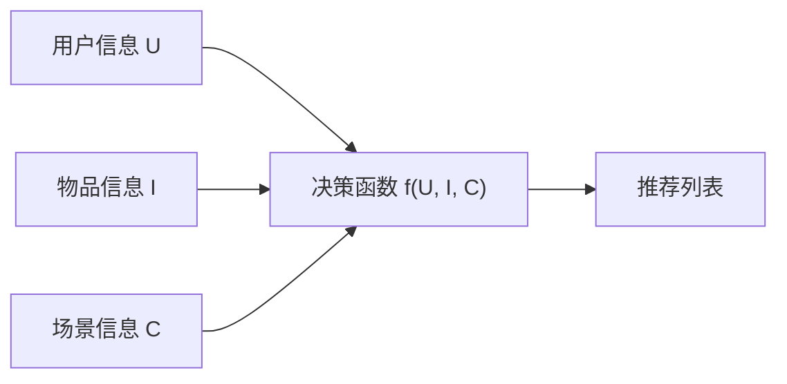

+++
title = "1-推荐系统——互联网的增长引擎"
date = "2026-01-04T10:30:00+08:00"

tags = ["广告系统", "推荐系统", "Deep Learning Recommender System 2.0"]
categories = ["搜广推"]
collections = ["Deep Learning Recommender System 2.0"]

draft = false
weight = 1
+++

> [!abstract]+
> 本章从**宏观视角**回答三个问题：
>
> * 为什么推荐系统被称为互联网的「增长引擎」
> * 一个工业级推荐系统的**完整技术架构是什么**
> * 在深度学习与大模型时代，推荐系统正在经历怎样的**范式演进**
>
> 这一章不涉及具体模型细节，而是为后续所有技术章节建立一个**统一的系统认知框架**。

---

## 推荐系统为何成为互联网的增长引擎

推荐系统几乎渗透进了所有互联网产品形态：

* 电商：商品推荐（猜你喜欢 / 关联购 / 以图搜同款的候选集）
* 内容平台：资讯 / 视频 / 音乐推荐（信息流、短视频瀑布流、播放队列）
* 广告系统：广告投放与竞价（RTB/OCPX 背后的“选谁 + 排序 + 出价”）
* 教育平台：课程与学习路径推荐（选课、章节顺序、内容难度自适应）

这些场景的共同点是：**供给侧无限丰富，用户侧注意力有限**。当可选内容规模远大于用户可消费规模时，平台必须解决一个核心问题——**在有限曝光机会里展示什么**。

> [!note]
> 推荐系统本质上是一个“注意力分配系统”：把有限的曝光（注意力预算）分配给最可能产生价值的内容/商品/广告。

从公司视角，“增长”通常表现为：

* 规模增长：DAU/MAU、留存、活跃
* 变现增长：收入、广告 eCPM、转化 GMV
* 体验增长：用户满意度、观看时长、复访频次

推荐系统之所以被称为增长引擎，是因为它把“算法改进”直接映射到“业务指标提升”。很多平台里，排序分数的微小改善（例如更好的点击/转化预估、更稳定的重排策略）会带来链路级放大效应：曝光 → 点击 → 转化 → 收入，在每一环累积增益。

---

## 推荐系统的双重价值：用户体验与商业目标如何统一

推荐系统的价值可以从两个视角同时成立，并且在健康的商业模式下通常是统一的。

* **用户视角：对抗信息过载**

  * 用户需求往往不明确，甚至是“逛”的状态。
  * 推荐系统需要根据历史行为与上下文，猜测用户可能喜欢什么，并把内容组织成可消费的序列。
  * 这与搜索系统不同：搜索是“用户提出问题”，推荐是“系统提出候选”。

* **公司视角：驱动商业目标**

  * 推荐系统要提升留存、时长、转化等指标，以实现持续增长。
  * 不同业务的核心目标不同：视频重时长、电商重 CVR/GMV、资讯重 CTR、广告重收益与 ROI。

> [!important]
> 推荐系统的关键难点不在于“能不能预测”，而在于“预测目标是否与业务目标一致”。目标一致性决定了推荐系统能否长期稳定地带来增长，而不是短期刷指标。

### 两个典型例子：YouTube 与电商平台

#### YouTube：观看时长是统一目标

YouTube 的广告收入与总观看时长强相关，因此它的推荐系统把目标聚焦在“观看时长”，而不是传统意义上的“点击率”。如果把点击率作为核心目标，可能会诱导模型偏好标题党、短平快内容，导致长期体验下降；而以观看时长为目标，则更容易把用户体验与商业利益对齐。

可以把这类目标抽象为：对每个候选内容 $ i $，预测用户在该内容上能产生的价值 $ V_i $（比如观看时长），再排序得到列表。

#### 电商：推荐是否合适直接影响收入

电商的核心在于“购买转化”。推荐系统在电商里更像“导购”：推荐的商品是否匹配用户需求，会直接影响是否下单。推荐链路的任何优化（更好的召回覆盖、更准的排序、更合适的重排策略）都可能直接反映到 CVR 与 GMV 上。

---

## 推荐问题的形式化描述：从直觉到函数 $$f(U, I, C)$$

把推荐问题抽象化，可以得到一个非常核心的形式：

$$
f(U, I, C) \rightarrow score
$$

其中：

* $ U $：用户信息（画像、历史行为、兴趣偏好、社交关系等）
* $ I $：物品信息（内容/商品/广告的属性、Embedding、质量、价格等）
* $ C $：场景信息（时间、地点、设备、网络状态、用户当下意图等）

系统目标是：在给定用户 $ U $ 与场景 $ C $ 的条件下，对海量物品 $ I $ 计算分数并排序，生成推荐列表。这里的 $ score $ 可以是：

* 预测点击概率（pCTR）
* 预测转化概率（pCVR）
* 预测观看时长
* 预期收益（广告场景可能是 eCPM 或更复杂的收益函数）

> [!note]
> $$f(U, I, C)$$ 不是“一个模型”那么简单，更像一个“决策函数”：它可以由模型 + 规则 + 约束 + 策略共同组成。

对应的抽象逻辑可以用一张最简图表达：

---

## 工业级推荐系统架构：数据系统 + 模型系统

工业推荐系统之所以“像工程”，是因为它不只是一个模型，而是“数据流 + 模型链路 + 评估闭环”的组合体。

### 数据系统：推荐的“水源”

数据系统的任务是把原始数据加工成三类产物：

1. **训练/评估样本**：用于离线训练与离线评估
2. **在线特征**：用于线上推断（低延迟、可实时更新）
3. **统计监控与 BI 数据**：用于业务洞察、监控报警、指标归因

数据处理通常按实时性与吞吐能力分层：

* 客户端/服务端实时处理：毫秒级，吞吐相对有限，但最及时
* 流处理平台：秒级/分钟级，兼顾实时性与规模
* 离线大数据平台：小时级/天级，吞吐最强，用于全量加工与回溯

> [!important]
> 深度学习推荐系统对实时性的要求更高：不仅要“收集实时数据”，还要“实时产出特征”，最终让模型服务能在实时特征上做推断。

### 模型系统：召回—排序—重排的级联结构

推荐系统的模型部分通常是多层级联架构，用于在海量候选与低延迟约束下做近似最优决策：

* **召回层**

  * 目标：从海量物品中快速找出“可能相关”的一小部分
  * 特点：强调效率与覆盖率，常用规则/向量检索/轻量模型
  * 直觉：宁可多召回一些，也不要漏掉潜力物品（避免错杀）

* **排序层**

  * 目标：在较小候选集上做精细化预估与排序
  * 特点：模型最复杂、效果贡献最大，深度学习主要集中在此
  * 直觉：把算力花在“最有可能展示”的候选上

* **重排层**

  * 目标：在返回用户之前融合策略，优化列表整体形态
  * 常见关注点：多样性、流行度、新鲜度、探索与利用、业务约束
  * 直觉：排序解决“相关性”，重排解决“体验与策略”

> [!note]
> 级联结构的本质是“逐层缩小候选集 + 逐层提升模型复杂度”，用工程方式逼近全量最优排序。

---

## 模型的生命周期：训练、评估与在线服务闭环

一个推荐模型从“能用”到“长期有效”，必须有完整闭环：

* 离线训练：用全量样本逼近全局最优
* 在线更新：准实时吸收新数据，追踪分布漂移
* 离线评估：快速筛掉无效改动，做候选方案对比
* 线上 A/B 测试：在真实流量验证收益与副作用
* 模型服务：低延迟推断、稳定性、可观测性与降级策略

> [!important]
> 推荐系统不是“训练完上线就结束”，而是“持续迭代的在线系统”。没有评估与更新机制的推荐系统，很快会因数据分布变化而失效。

---

## 深度学习与大模型时代：从单点优化走向协同创新

深度学习的革命性贡献在于：

* 更强的拟合能力：能学习复杂数据模式
* 更强的特征组合挖掘：自动学习高阶交互
* 结构更灵活：可根据场景设计网络结构

但在 2021 年之后，行业逐渐面临瓶颈：

1. 模型越来越大、工程开销急剧上升，收益递减
2. 结构创新本身的红利变少，单靠“换模型”难以突破

因此，新的增长方向逐渐清晰：

* **算法与工程的协同设计**：模型设计要考虑服务架构与数据流，工程升级要能转化为模型收益
* **大模型与推荐系统结合**：引入世界知识、交互式范式、多模态 AIGC 等能力

> [!note]
> 可以把新阶段理解为“三者叠加”：推荐算法 + 推荐工程架构 + 大模型应用。目标是让系统整体产生 $$1 + 1 + 1 > 3$$ 的效果，而不是各自独立做局部最优。

---

## 本章小结

> [!note] 总结
>
> * 推荐系统之所以是增长引擎，是因为它把“算法改进”直接映射到“业务指标提升”
> * 推荐问题可抽象为 $$f(U, I, C)$$：在用户、物品、场景三类信息上做决策与排序
> * 工业级推荐系统由“数据系统 + 模型系统”组成，并通过训练—评估—服务形成闭环
> * 深度学习带来精度革命，也带来实时性与工程复杂度挑战
> * 未来趋势从单点模型优化转向：算法-工程协同，以及大模型的结合与落地
