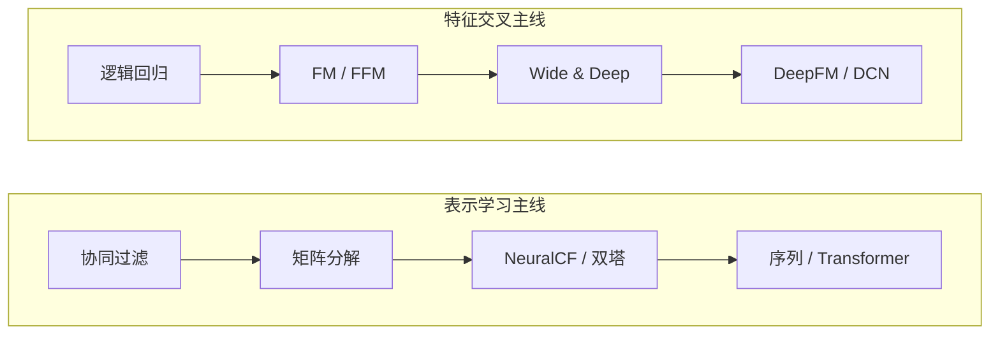
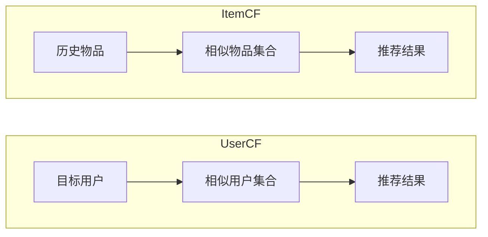
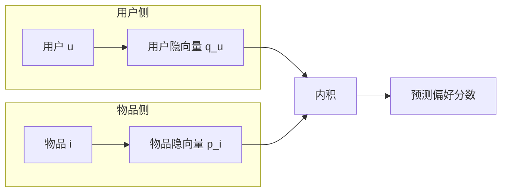
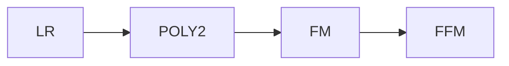
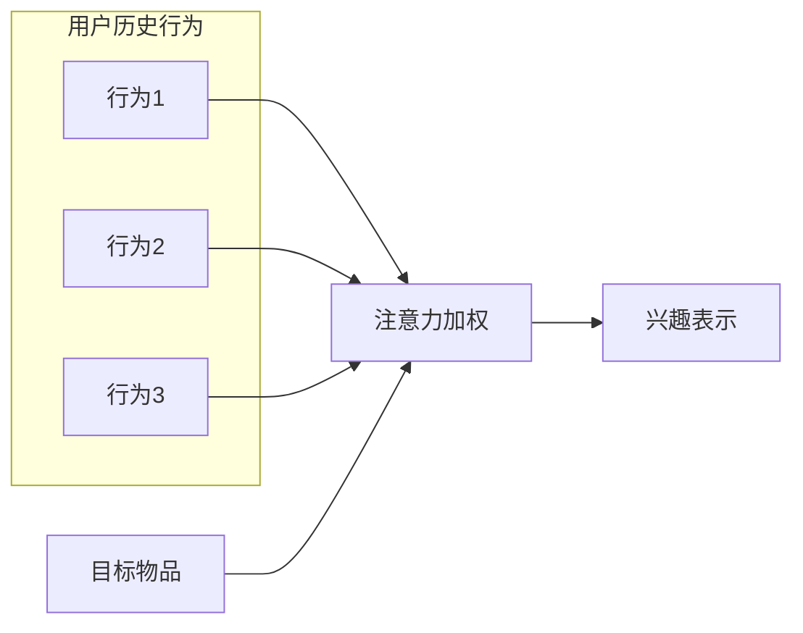
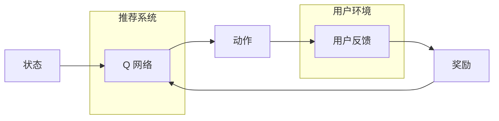

+++
title = "2-推荐之心——深度学习推荐模型的进化之路"
date = "2026-01-04T11:30:00+08:00"

tags = ["推荐系统", "深度学习", "协同过滤", "Deep Learning Recommender System 2.0"]
categories = ["搜广推"]
collections = ["Deep Learning Recommender System 2.0"]

draft = false
weight = 2
+++

> [!abstract]+
> 本章围绕“推荐之心”——**推荐模型**展开，梳理推荐模型从经典方法到深度学习时代的完整演化脉络：
>
> * 经典时代：协同过滤（UserCF / ItemCF）→ 矩阵分解（MF）
> * 工业主线：逻辑回归（LR）→ 特征交叉（POLY2 / FM / FFM）
> * 深度学习时代：DeepCrossing → NeuralCF（双塔思想）→ Wide&Deep → DeepFM / NFM / DCN
> * 表达升级：注意力机制（AFM / DIN）→ 序列兴趣演化（DIEN / Transformer-TransAct）
> * 实时学习：强化学习推荐（DRN）
>
> 这一章的核心目标不是“背模型”，而是建立：**模型为什么出现、解决什么瓶颈、适合什么场景、代价是什么**的系统认知。

---

## 推荐模型的演化图谱：两条主线与三类瓶颈

推荐模型的发展并非随机堆叠，而是在持续对抗三个长期瓶颈：

* **稀疏性**：用户-物品交互矩阵极度稀疏，长尾严重
* **特征表达**：真实业务需要融合用户/物品/上下文多源特征
* **兴趣动态**：用户兴趣随时间演化，静态模型难以捕捉

从演化视角看，存在两条非常清晰的主线：

### 主线 A：相似度与表示学习（CF → MF → 双塔/序列/图/自监督）

* 协同过滤用“相似用户/相似物品”完成推荐
* 矩阵分解用隐向量学习用户与物品表示
* 深度学习把“表示学习”做得更强（双塔、序列、Transformer 等）

### 主线 B：监督学习与特征交叉（LR → POLY2 → FM/FFM → Wide&Deep → DeepFM/DCN）

* LR 解决“用监督学习做 CTR 预估并排序”
* POLY2 / FM / FFM 解决“特征交叉与组合爆炸”
* Wide&Deep 解决“记忆能力 + 泛化能力”
* DeepFM / DCN 解决“自动特征交叉、减少人工特征工程”

> [!note]
> 你可以把推荐模型理解为：在“稀疏交互”与“多源特征”之间，寻找一种可训练、可泛化、可上线的映射
> $$ f(U, I, C) \rightarrow score $$
> 其中 $U$ 是用户，$I$ 是物品，$C$ 是上下文（时间、位置、设备、场景等）。

---

## 协同过滤：经典推荐算法（UserCF / ItemCF）

协同过滤是推荐系统史上影响力最大、应用最广泛的一类方法之一。它的核心假设很直观：

> **兴趣相似的人会喜欢相似的物品；与我喜欢的物品相似的物品，我也可能喜欢。**

### 什么是协同过滤：共现矩阵与相似度

在数学表达上，协同过滤首先构建用户-物品交互矩阵（共现矩阵）$R$：

* 若只关心是否交互，可令 $R_{u,i}\in{0,1}$
* 若有显式反馈（评分），可令 $R_{u,i}$ 为评分值
* 无交互时的填充值（0/缺失/默认）取决于业务定义与训练方式

协同过滤的关键问题可拆为三步：

1. 如何形式化交互矩阵 $R$
2. 如何定义相似度（用户相似 / 物品相似）
3. 如何从相似度得到最终的排序得分

---

### UserCF：基于用户相似度的协同过滤

UserCF 的基本流程：

1. 计算用户两两之间的相似度
2. 取目标用户的 Top-$n$ 相似用户
3. 用相似用户对物品的反馈加权得到目标用户对物品的推荐得分
4. 排序输出

常见的相似度计算方式包括：

* **余弦相似度**
  
  $$
  sim(u,v)=\frac{\vec{r}_u\cdot \vec{r}_v}{|\vec{r}_u||\vec{r}_v|}
  $$

* **皮尔逊相关系数**（用均值中心化缓解评分偏置）
  
  $$
  sim(u,v)=\frac{\sum_{i\in I}(R_{u,i}-\bar R_u)(R_{v,i}-\bar R_v)}{\sqrt{\sum_{i\in I}(R_{u,i}-\bar R_u)^2}\sqrt{\sum_{i\in I}(R_{v,i}-\bar R_v)^2}}
  $$

最终对物品 $p$ 的推荐得分常用加权平均形式：
$$
\hat R_{u,p}=\frac{\sum_{s\in S(u)} w_{u,s}R_{s,p}}{\sum_{s\in S(u)} w_{u,s}}
$$
其中 $S(u)$ 是 Top-$n$ 相似用户集合，$w_{u,s}=sim(u,s)$。

* **优点**
  * 原理简单，可解释性强
  * 能反映“社交化”兴趣迁移：相似用户近期喜欢什么会影响我
  
* **局限**
  * 用户规模通常远大于物品规模，用户相似度计算与维护成本高
  * 稀疏/长尾问题明显：尾部物品难以被相似度捕捉，推荐头部效应更强

---

### ItemCF：基于物品相似度的协同过滤

ItemCF 的基本流程：

1. 计算物品两两之间的相似度（共现、余弦、Jaccard 等）
2. 对用户历史正反馈物品集合 $H(u)$，用相似度加权得到候选物品得分
3. 排序输出

典型得分形式：
$$
\hat R_{u,p}=\sum_{i\in H(u)} w_{p,i},R_{u,i}
$$

关于是“加权累加”还是“加权平均”，取决于业务理解：

* 若认为相似证据可叠加增强兴趣 → 更偏向加权累加
* 若希望把得分映射到稳定区间、避免历史行为数量影响过大 → 更偏向加权平均

* UserCF vs ItemCF：适用场景差异
  * UserCF 更适合热点快速扩散的场景（如新闻）：更像“跟随相似人群趋势”
  * ItemCF 更适合兴趣相对稳定的场景（如电商）：物品相似性更稳定、可复用

---

## 矩阵分解：协同过滤的泛化升级（MF）

协同过滤的核心痛点之一是泛化能力不足：它难以把“相似性信息”迁移到未共现的物品/用户上，尾部物品更难被推荐。

矩阵分解用隐向量解决这一问题：

* 为每个用户学习隐向量 $q_u\in\mathbb{R}^k$
* 为每个物品学习隐向量 $p_i\in\mathbb{R}^k$
* 用内积预测偏好
  $$
  \hat R_{u,i}=q_u^\top p_i
  $$

目标函数（带 $L_2$ 正则）：
$$
\min_{q,p}\sum_{(u,i)\in K}(R_{u,i}-q_u^\top p_i)^2+\lambda\left(|q_u|^2+|p_i|^2\right)
$$

### 为什么 MF 成为里程碑

Netflix Prize 等竞赛推动了 MF 在工业界的普及：它能用低维隐空间捕捉“隐含兴趣/隐含属性”，显著缓解稀疏问题。

### MF 的主流求解方式：SGD 与 ALS

理论上可用 SVD 等分解方法，但在工业规模下复杂度过高。推荐系统常用：

* **SGD（梯度下降）**：对样本逐步更新 $q_u,p_i$
* **ALS（交替最小二乘）**：固定一侧求另一侧，交替迭代

> [!important]
> MF 的关键收益是“泛化”，但它的局限也很明确：主要利用交互矩阵，难以自然融合丰富的用户/物品/上下文特征。

---

## 从 LR 到 FM/FFM：多特征融合与特征交叉

推荐系统在广告/信息流等场景中，常被建模为 CTR 预估与排序问题：给定样本特征 $x$，预测点击概率 $p$ 并排序。

### LR：工业 CTR 预估的起点

逻辑回归推断形式：
$$
p=\sigma(w^\top x + b),\quad \sigma(z)=\frac{1}{1+e^{-z}}
$$

推荐流程（训练与上线）本质是：

* 特征工程：把用户/物品/上下文转成数值特征（含 one-hot）
* 监督学习：以点击/转化为标签训练 $w$
* 在线推断：对候选物品计算 $p$ 并排序

* **LR 的优势**
  * 结构简单，训练稳定，易部署
  * 适合大规模稀疏 one-hot 特征（线性模型可解释）

* **LR 的局限**
  * 不具备强的特征组合能力：高阶交互需要人工构造

---

### POLY2：显式二阶交叉

POLY2 在 LR 基础上显式加入二阶交叉：
$$
\hat y=w_0+\sum_i w_i x_i+\sum_{i<j} w_{ij}x_i x_j
$$

问题在于 $w_{ij}$ 参数规模为 $O(n^2)$，在真实业务特征维度下很快不可控。

---

### FM：用隐向量做二阶交叉

FM 的核心思想：为每个特征学习隐向量 $v_i\in\mathbb{R}^k$，用内积表达二阶交互权重：
$$
\hat y=w_0+\sum_i w_i x_i+\sum_{i<j}\langle v_i,v_j\rangle x_i x_j
$$

* FM 解决了什么？
  * 把 $w_{ij}$ 的显式参数，替换为隐向量内积 → 参数从 $O(n^2)$ 降到 $O(nk)$
  * 在稀疏特征下也能学习合理交互（共享隐向量带来泛化）

* FM 的边界
  * 二阶交互很强，但高阶交互仍有限
  * 不同来源特征（字段/域）的交互强弱差异难以精细表达

---

### FFM：引入 Field（特征域）刻画“交互语义差异”

FFM 引入特征域（Field）：同一个特征在与不同域的特征交叉时使用不同隐向量。

对特征 $i$，与域 $f$ 相关的隐向量记为 $v_{i,f}$，则：
$$
\hat y=w_0+\sum_i w_i x_i+\sum_{i<j}\langle v_{i,f_j}, v_{j,f_i}\rangle x_i x_j
$$

* **直观理解**
  * “性别 × 广告主” 与 “性别 × 媒体” 语义不同
  * FFM 允许特征在不同交互语境下有不同表示

* **代价**
  * 参数规模变大，训练开销显著上升（工程成本更高）

---

## DeepCrossing：深度学习推荐模型的开端

DeepCrossing 常被视为深度学习推荐模型的重要起点：它把“Embedding + MLP”这套深度学习范式引入推荐系统，实现自动特征组合。

典型结构：

1. 稀疏类别特征 → Embedding
2. 稠密特征 + Embedding 拼接
3. 多层网络拟合非线性关系
4. 输出 CTR/排序分数

DeepCrossing 的关键工程化思想是：

* 用深层网络完成“高阶交叉”的自动学习
* 减少对人工构造交叉特征的依赖

> [!note]
> DeepCrossing 的启示：深度学习不一定要先“发明新结构”，先把推荐问题迁移到可训练的神经网络框架里，本身就能带来质变。

---

## NeuralCF：双塔思想的经典应用

传统 MF 用 $q_u^\top p_i$ 作为用户-物品交互函数。NeuralCF 的核心创新是：

> [!important]
> **把“点积”替换为“神经网络交互函数”，增强表达能力。**

常见构造包括：

* GMF（Generalized MF）：保留类似 MF 的结构（向量逐元素交互）
* MLP：把用户向量与物品向量拼接后送入多层感知机
* NeuMF：融合 GMF 与 MLP 的输出

这一类模型本质上强化了双塔路线：

* 用户侧聚合用户特征 → 用户向量
* 物品侧聚合物品特征 → 物品向量
* 交互层决定最终得分（点积 / MLP / 混合）

* **优势**
  * 易扩展到召回（向量检索）与排序（精细交互）
  * 工业界落地成熟（尤其在召回阶段）

* **局限**
  * 若只用用户/物品 ID 或少量特征，仍难充分利用上下文与丰富特征

---

## Wide&Deep：记忆能力与泛化能力的统一

Wide&Deep 的出发点非常工程化：

* **Wide（线性+交叉）**：强“记忆”，擅长记住稀疏特征的共现规律
* **Deep（Embedding+MLP）**：强“泛化”，擅长学习未见过的组合模式

典型融合形式：
$$
p=\sigma\left(y_{\text{wide}}+y_{\text{deep}}\right)
$$

其中：

* $y_{\text{wide}}$ 通常是线性模型（可含人工交叉特征）
* $y_{\text{deep}}$ 是深度网络输出

* **关键贡献**
  * “组合模型”范式成为后续大量模型的基础

* **痛点**
  * Wide 部分仍依赖人工筛选与构造交叉特征（工程成本高）

---

## 更强特征交叉：DeepFM / NFM / DCN

这一阶段的主目标是：在保持 Wide&Deep 工程可用性的前提下，让特征交叉更强、更自动化。

### DeepFM：用 FM 替代 Wide

DeepFM 用 FM 替代 Wide 部分的线性+人工交叉，同时与 Deep 部分共享 Embedding：

* FM 分支：自动学习二阶交叉
* Deep 分支：学习高阶非线性交互

最终仍是融合输出：
$$
p=\sigma(y_{\text{FM}}+y_{\text{Deep}})
$$

* **收益**
  * 兼顾记忆与泛化
  * 减少人工交叉特征工程

---

### NFM：FM 的神经网络化尝试

NFM 的核心思路：

* 先对二阶交互做“聚合”（常称 bi-interaction pooling）
* 再通过 MLP 学习更复杂的非线性关系

它可以理解为：把 FM 的二阶交互结果作为更适合深度网络处理的中间表示，从而增强表达能力。

---

### DCN（Deep & Cross）：显式 Cross Network 做特征交叉

DCN 引入 Cross Network，让特征交叉以一种“显式、可控”的形式逐层累积：

设输入为 $x_0$，Cross 层递推：
$$
x_{l+1}=x_0(x_l^\top w_l)+b_l+x_l
$$

直观理解：

* 每一层把 $x_0$ 与当前 $x_l$ 做显式交互
* 交互项的系数由 $w_l$ 控制
* 相比纯 MLP，Cross 更强调“可解释的显式交叉路径”

* **权衡点**
  * Cross 层数越多，交叉阶数越高，但复杂度与训练难度也会上升
  * 工程上要在“交叉能力、参数规模、延迟”之间做取舍

> [!important]
> 到这一阶段，你会发现推荐模型的优化经常不是“结构越复杂越好”，而是要结合：数据规模、稀疏性、延迟预算、特征可用性综合决策。

---

## 注意力机制：AFM 与 DIN

注意力机制（Attention）的核心是：对多个候选信息分配不同权重，做加权汇聚。

一般形式：
$$
\alpha_i=\text{softmax}(e_i),\quad \text{Attn}(x)=\sum_i \alpha_i x_i
$$

### AFM：给 FM 的交叉项加“重要性权重”

AFM 在 FM 的二阶交叉基础上引入注意力网络，为每个交叉对 $(i,j)$ 生成权重 $\alpha_{ij}$：

$$
\hat y=w_0+\sum_i w_i x_i+\sum_{i<j}\alpha_{ij},\langle v_i,v_j\rangle x_i x_j
$$

> [!important]
> 它回答的问题是：
> **并不是所有二阶交叉都同等重要，模型应当自动学习“哪些交叉更关键”。**

---

### DIN：面向目标物品的“行为注意力”

DIN 的动机来自实际广告/推荐场景：

* 用户历史行为很多，但与当前候选物品相关的只有一部分
* “同一个用户”，面对不同目标物品，应激活不同兴趣

DIN 用目标物品作为 Query，对用户历史行为做注意力汇聚，形成“与目标相关”的兴趣表示：

* 历史行为 Embedding：$h_1,\dots,h_T$
* 目标物品 Embedding：$e$
* 通过注意力得到用户兴趣向量：
  $$
  u(e)=\sum_{t=1}^T \alpha_t(e),h_t
  $$

> [!important]
> DIN 的关键启示是：
> **推荐不仅要“建模用户”，还要“建模用户对当前目标的相关兴趣”。**

---

## 序列模型：用户兴趣进化（DIEN / Transformer-TransAct）

当推荐系统开始强依赖“时间相关性”时，静态模型会遇到明显瓶颈：

* 同一用户在不同时间兴趣不同
* 行为序列蕴含强信号（最近行为更相关、兴趣会漂移）

### DIEN：用序列模型刻画“兴趣进化”

DIEN 的核心动机是：DIN 虽然做了行为注意力，但对兴趣随时间的演化建模仍不充分。

DIEN 的典型结构可以概括为两步：

1. **Interest Extractor**：用 GRU 等结构从行为序列中抽取兴趣状态序列
2. **Interest Evolving**：结合目标物品，利用注意力引导兴趣向目标方向演化（例如使用带注意力的 GRU 变体）

同时，DIEN 引入辅助损失，强化对“兴趣状态”的学习，使序列模型训练更稳定、表达更强。

* **工程意义**
  * 序列模型显著增强对兴趣变迁的表达能力
  * 但线上推断延迟更高，需要专门优化（缓存、截断、并行、分层更新等）

---

### Transformer 序列推荐：Pinterest 的 TransAct

Transformer 在序列建模上具有天然优势：

* Self-Attention 能在序列内捕捉远距离依赖
* 并行计算更适合现代硬件

TransAct 的重要工程思想之一是把用户兴趣拆为两部分：

* **长期兴趣**：更新频率低（例如天级），强调稳定偏好
* **实时兴趣**：更新频率高（实时或近实时），强调短期意图

这种拆分本质上是“模型结构”与“工程更新策略”的协同设计：

> 把最耗时的部分做低频更新，把最关键的短期意图做高频更新，在延迟与效果之间取得平衡。

---

### 序列模型的启发

* 用户兴趣不是静态向量，而是随时间演化的过程
* 需要从“点建模”走向“序列/状态建模”
* 工程上必须考虑：序列长度、更新频率、线上缓存与延迟预算

---

## 强化学习推荐：从静态训练到在线学习（DRN）

强化学习把推荐问题重新表述为序列决策过程：

* 智能体：推荐系统（推荐模型 + 探索策略 + 记忆/数据存储）
* 环境：用户与内容系统
* 状态：用户特征、环境特征等
* 行动：输出推荐列表/推荐物品
* 奖励：点击/停留/活跃等反馈

### DRN：用 DQN 做推荐决策

DRN 采用 Deep Q-Network（DQN）思想：学习 $Q(s,a)$ 评估在状态 $s$ 下执行行动 $a$ 的“质量”。

在工程特征上，常把：

* 用户特征、环境特征 → 状态向量 $s$
* 用户-物品交叉特征、物品特征 → 行动相关向量 $a$

最终得到 $Q(s,a)$ 用于决策。

### 学习过程：在线迭代与实时反馈

强化学习推荐相较传统深度学习的核心优势在于：

> **在线学习**：持续接收最新反馈并更新模型，让模型与“最新数据分布”同步。

### 在线更新：竞争梯度下降（探索网络）

一种典型在线更新思路是：

1. 对当前网络参数 $W$ 加随机扰动生成探索网络 $W'$
2. 当前网络与探索网络分别生成推荐列表，交织（Interleaving）后展示
3. 若探索网络效果更好，则替换当前网络，否则保留

扰动形式可写为：
$$
\Delta W=\alpha\cdot rand(-1,1)\cdot W
$$

其中 $\alpha$ 控制探索力度。

### 强化学习的启发：重量级 vs 实时性

强化学习提出一个很现实的工程问题：

* 是做一个复杂但更新慢的“完美模型”
* 还是做一个轻量但可实时更新的“敏捷模型”

工程世界没有唯一答案，只能用实际效果与成本约束来选择，但“实时性”已经成为推荐系统必须严肃对待的维度。

---

## 展望

当模型结构已经复杂到 DIEN、Transformer 级别后，“继续堆结构”能带来的边际收益会变小。近年的突破趋势更偏向三类方向：

1. **模型与工程协同设计**：在工程约束下挖掘最大收益（例如端侧推荐、召回新框架、粗排工程化方案等）
2. **推荐系统独立子问题优化**：多目标联合优化、探索与利用、多样性优化、图神经网络等
3. **推荐系统与大模型结合**：用大模型增强特征输入、参与交互式推荐，甚至生成推荐内容/广告创意

> [!important]
> 推荐系统的下一阶段不再是“单一路线的主模型竞赛”，而是多个子方向并行发展、系统级协同优化的时代。

---

> [!note] 总结
>
> * 经典推荐以协同过滤为起点，核心是相似度与共现；矩阵分解用隐向量提升泛化能力。
> * 工业排序主线从 LR 出发，经历 POLY2 → FM/FFM → Wide&Deep，逐步增强特征交叉能力并降低人工特征工程依赖。
> * 深度学习模型的关键方向包括：
>
>   * 自动特征交叉：DeepFM / NFM / DCN
>   * 目标相关兴趣建模：DIN
>   * 兴趣序列演化：DIEN / Transformer（TransAct）
>   * 在线学习与实时更新：强化学习（DRN）
> * 深度学习时代没有“通吃模型”，模型选择应同时考虑：**效果、特征可用性、延迟预算、更新频率、工程成本**。
