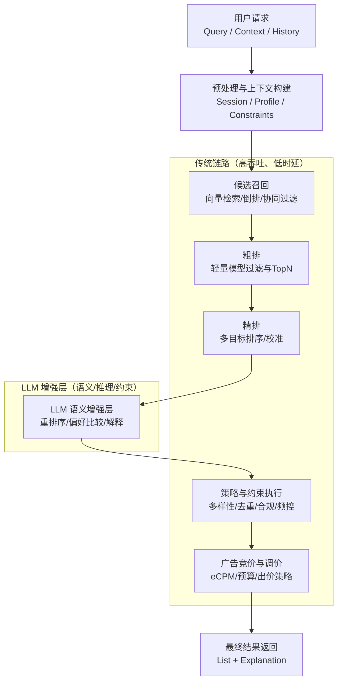

+++
title = "3-浪潮之巅——大模型在推荐系统中的创新"
date = "2026-01-12T15:00:00+08:00"

tags = ["推荐系统", "大模型", "LLM", "广告系统", "搜广推", "Deep Learning Recommender System 2.0"]
categories = ["搜广推"]
collections = ["Deep Learning Recommender System 2.0"]

draft = false
weight = 3
+++

> [!abstract]+
> 大语言模型（Large Language Model, LLM）进入推荐系统后，最大的变化不是“模型更大”，而是**信息表达方式与决策方式发生迁移**：从结构化特征驱动的概率预测，扩展为以语义理解、意图推理与约束决策为中心的系统工程。
> 工业界更倾向于把 LLM 作为“高阶语义与策略层”，与传统的召回、粗排、精排和竞价体系协同，而非直接替代。
> 本文从工程视角梳理大模型推荐的架构落点、可度量目标、训练与推理形态、与广告链路的耦合方式，以及落地约束与常见失败模式。

---

## 推荐系统范式的演进背景

传统推荐系统的主干可以概括为：在既定候选集合上，通过可控的特征空间学习一个打分函数，然后在在线流量中以极低时延完成排序与过滤。该范式成立的前提通常包括：用户兴趣可被有限维度的特征近似表达；物品的价值可被少量统计标签与交叉特征充分刻画；场景分布在短周期内相对平稳，从而使离线训练与在线服务保持一致。

在这一假设下，推荐任务经常被形式化为概率预测与排序优化。对单一行为而言，模型学习的目标通常是 $p(y=1\mid x)$；对多目标业务而言，系统会把多个概率与价值项组合成一个可解释且可调的评分函数，例如：

$$
\text{Score}(x) = \alpha \cdot pCTR(x) + \beta \cdot pCVR(x) + \gamma \cdot \text{Value}(x)
$$

其中 $x$ 是用户、物品与上下文的联合表示，$\alpha,\beta,\gamma$ 体现业务在点击、转化与价值之间的权衡。广告系统里，收益导向更直接，常见的目标是最大化期望收益（以千次展示收益计）：

$$
eCPM = Bid \times pCTR \times 1000
$$

然而，随着内容形态变复杂（长文本、视频、多模态）、用户路径更长（跨场景、多轮交互）、决策约束更多（合规、体验、多样性、供给侧约束），传统范式逐步出现结构性瓶颈：

- **表达瓶颈**：大量真实意图隐含在文本、对话、评论、搜索 Query 与跨会话行为中，难以被静态离散特征充分承载；特征可以增长，但语义一致性与泛化能力不会线性增长。
- **泛化瓶颈**：冷启动、长尾兴趣、跨域迁移需要强语义先验；仅靠共现与统计相似性容易“只会记忆，不会理解”。
- **约束瓶颈**：排序不仅是相关性最大化，往往还要同时满足体验与策略约束；传统方式依赖大量人工规则与重训迭代，工程成本高且难维护。
- **解释瓶颈**：推荐结果为何合理难以表达，尤其在内容分发与对话推荐中，可解释性与可控性逐渐成为产品能力的一部分。

这些压力共同促成了 LLM 进入推荐系统：不是为了把 $pCTR$ 变成一个更大的网络，而是为了引入更强的“语义理解与推理能力”，以降低表达成本并提升跨分布鲁棒性。

---

## 大模型推荐的核心思想

“大模型推荐”在工程上更准确的定义是：在推荐链路的一个或多个环节中，引入 LLM 来处理传统模型难以直接建模的部分信息（非结构化语义、多轮上下文、复杂约束），并把其输出以可控的方式转化为在线可执行的策略或排序信号。它并不天然要求端到端“LLM 生成最终列表”，因为在线系统首先要满足可控性、稳定性与成本约束。

可以把推荐决策拆成两类能力：

1. **统计学习能力**：在大规模曝光数据上稳定预测行为概率，具备低时延、可量化、可回归的优势。
2. **语义推理能力**：对自然语言、上下文、隐式意图进行理解与推断，能处理“文本描述的约束”与“组合式偏好”。

LLM 的价值主要体现在第二类能力上，具体表现为：

- **输入空间升级**：从特征向量 $x$ 扩展为自然语言上下文 $c$ 与多模态线索；即便最终仍服务于数值排序，语义理解可以作为额外信号进入打分函数。
- **目标形态升级**：从单一 $p(y\mid x)$ 扩展为“意图匹配”“偏好一致”“约束满足”等更贴近产品语义的目标；这些目标可以通过偏好数据、对比学习或人类反馈构建。
- **决策机制升级**：从“独立打分后排序”拓展为“成组比较、解释与约束推理”；这使得系统可以表达诸如“更符合最近意图”“避免重复”“控制敏感类目”等要求。

为了把 LLM 输出落到可控的线上决策，一般会把它约束在可检验的中间表示上，例如：语义标签、候选对比偏好、重排分数、或结构化的策略建议。其关键是：**LLM 负责理解，传统系统负责执行**，并通过校验与回退保证稳定性。

---

## 大模型推荐系统的整体架构

推荐链路在工业界通常分层：召回负责规模、粗排负责快速收敛、精排负责效果、策略层负责约束与收益。在这个框架下，LLM 更像“插入式增强层”，典型位置是：召回增强、重排序、策略生成或解释生成。

该架构背后的工程含义是：LLM 通常只处理一个“小而精”的候选集（例如 Top-$k$），并且其结果需要被策略层、竞价层以确定性规则再加工，避免不稳定输出直接影响线上收益。换句话说，LLM 的“自由度”被限制在可控范围内，而不是直接控制最终曝光。

---

## LLM 在推荐链路中的典型落点

### 召回阶段：语义驱动的候选扩展

召回的核心目标是在严格的时延与资源约束下，尽可能覆盖“可能相关”的候选。传统召回依赖共现、相似度与索引结构，强项是规模与效率，但在“意图表达”上容易失真：用户的真实需求可能来自一句话、一次搜索、或一段对话，难以被离散特征直接映射到候选空间。

LLM 进入召回，典型做法不是让 LLM 直接遍历全库，而是让它生成或抽取一个语义表示，再交由向量检索或倒排完成规模化召回。用形式化描述可以写成：

- LLM 将上下文 $c$（搜索 Query、对话、近期行为）映射为意图表征 $I(c)$；
- 检索系统在向量空间或索引空间中求近邻，得到候选集合 $\mathcal{K}$。

$$
I(c) = \text{LLM}(c), \quad \mathcal{K} = \text{Retrieve}(I(c))
$$

其中 $\text{Retrieve}(\cdot)$ 往往是 ANN（Approximate Nearest Neighbor）检索或多路召回融合。这个分工确保了 LLM 的高成本推理只发生在“每个请求一次”的意图构建上，而不是“每个候选一次”的评分上。

此外，LLM 还可用于召回侧的**语义扩展**：把用户表达扩展为同义与相关概念，从而提升长尾覆盖。例如用户意图包含“预算有限但要轻薄”，LLM 可以抽取约束（轻薄、续航、价格）并形成检索向量或关键词集合，从而减少仅靠共现导致的召回缺失。

---

### 排序阶段：LLM 重排序（LLM Re-ranking）

LLM 重排序是当前最常见、最可控的落地方式，因为它天然符合“对小集合做复杂计算”的工程结构：传统排序先给出 Top-$k$ 候选，LLM 再对这 $k$ 个候选进行语义比较与调整。其价值在于：传统精排对结构化特征极强，但对“文本语义一致性”“上下文依赖”与“组合偏好”常常不足，而这些正是 LLM 的强项。

重排序的一个关键差异是：LLM 更适合做**相对判断**而非绝对打分。传统排序输出的是可校准的分数 $s_i$；LLM 更自然的输出是偏好关系，例如“在候选 $i$ 与 $j$ 中更偏好谁”。工程上可用以下方式落地：

1. **对比偏好转分数**：将偏好关系转换为相对得分或排序
   $$
   i \succ j \Rightarrow \Delta_{ij} > 0
   $$

2. **融合式重排**：保留原有精排分数作为基准，再叠加 LLM 的语义偏好项
   $$
   \text{FinalScore}_i = \lambda \cdot s_i + (1-\lambda)\cdot r_i
   $$
   其中 $s_i$ 来自精排模型，$r_i$ 是 LLM 产生的重排分数或偏好强度，$\lambda$ 控制对 LLM 的信任程度，通常需要在线 A/B 调参与回退机制。

LLM 在重排序中真正有价值的点是：它可以理解“为什么不合适”。例如候选标题与用户意图表面相关但语义冲突（品牌偏好、规格约束、风格不符），传统特征可能无法显式表达，而 LLM 可以通过自然语言推理把冲突显式化，从而在 Top-$k$ 内做出更符合意图的调整。

---

### 决策与策略阶段：生成式推荐与约束满足

在更激进的形态下，LLM 可以输出“推荐方案”而不只是排序分数，特别是在对话式推荐、内容聚合或任务型场景中：用户的目标不是“点哪个”，而是“得到一组能执行的建议”。此时推荐更像“在约束下生成”，而不是“在候选中打分”。

可以把该过程看作一个带约束的决策问题。若把推荐集合表示为 $S$，约束集合表示为 $\mathcal{C}$，目标函数表示为 $J(\cdot)$，那么系统希望：

$$
S^* = \arg\max_{S} J(S) \quad \text{s.t. } S \models \mathcal{C}
$$

其中 $S \models \mathcal{C}$ 表示推荐结果满足约束（例如去重、类目占比、敏感过滤、频控等）。LLM 在这里适合承担“生成候选方案 + 给出理由”，但最终仍需要策略引擎对 $S$ 做硬约束校验与修正，这一点在合规和体验敏感的业务中几乎不可缺少。

---

## 与广告系统的结合视角

广告系统与内容推荐的关键差异在于目标函数：广告需要显式最大化收益并受预算、竞价与曝光约束影响。经典链路往往是：召回 → 粗排 → 精排 → 竞价/调价 → 展示，其中排序分数与竞价收益强耦合。

在最简化的单广告位模型中，系统希望最大化：

$$
\mathbb{E}[\text{Revenue}] = \mathbb{E}[Bid \cdot \mathbf{1}(\text{click})]
$$

用概率替代点击事件，有：

$$
\mathbb{E}[\text{Revenue}] \approx Bid \cdot pCTR
$$

在实际系统里会引入转化、价值与校准项，但核心仍是“可控、可解释、可回归”的数值目标。LLM 进入广告链路时，常见的合理定位是：

- **不直接替代 $pCTR/pCVR$**：这些概率需要稳定校准与严格回归；LLM 输出难以天然满足校准与一致性要求。
- **用于语义与策略增强**：例如理解 Query 意图、识别广告素材与落地页的语义匹配、补充用户阶段意图、或提升重排质量。

一个常见的工程形态是：先由精排与竞价给出一个“收益优先”的候选列表，再用 LLM 对列表做策略感知调整，例如提升相关性、降低重复、抑制误触或体验差的广告。最终仍以收益为主目标，但引入体验与长期价值作为约束或正则项：

$$
\text{FinalRank} = \text{ArgSort}\big(\underbrace{eCPM}*{收益} + \eta \cdot \underbrace{\text{LLM_Relevance}}*{语义} - \mu \cdot \underbrace{\text{BadExperience}}_{体验风险}\big)
$$

其中 $\eta,\mu$ 需要在线调参与风险控制，且“体验风险”通常要落到可计算信号（例如投诉、跳出、重复曝光惩罚）上，而不是仅凭自然语言理由。

---

## 工程现实与落地约束

> [!note] 工程落地的核心矛盾
> LLM 在推荐里最强的是语义与推理，但在线系统最需要的是确定性、低时延与低成本；因此落地的关键不是“能不能用”，而是“把它限制在能被系统消化的位置”。

主要约束通常集中在四类：

1. **时延约束（Latency）**
   在线推荐常见 SLA 是毫秒级，LLM 即使使用小模型或量化，也难以在高并发下稳定满足。可行的方向往往是：仅对 Top-$k$ 做重排、缓存热门请求结果、或把部分推理下沉为离线特征。

2. **成本约束（Cost）**
   LLM 推理成本远高于传统排序模型。系统必须回答一个工程问题：每一次 LLM 调用带来的收益增量是否覆盖成本增量。若无法覆盖，就需要更强的触发条件（仅对高价值流量调用）或更轻的模型（蒸馏到小模型）。

3. **稳定性约束（Stability）**
   LLM 输出存在随机性与漂移风险。即便固定模型权重，不同提示词、不同上下文长度、不同候选排列顺序都可能影响输出。工程上通常需要：固定模板、结构化输出、温度控制、结果校验，以及明确的回退策略（例如回到精排结果）。

4. **评估约束（Evaluation）**
   LLM 引入的收益往往体现在“长期价值、体验指标或意图一致性”，而离线指标可能无法准确反映。即便线上指标提升，也必须确认是否存在副作用（例如短期点击提升但投诉上升）。因此需要更完整的指标体系与实验设计。

---

## 大模型推荐的合理定位

将上述能力与约束综合起来，一个更稳定、可复制的定位是：LLM 作为“语义与策略层”，在不破坏主链路稳定性的前提下，提供增量价值。具体而言，它更适合承担以下职责：

- **把非结构化信息变成结构化信号**：从文本、对话与多模态中抽取意图、约束、偏好与风险标签，作为召回与排序的输入。
- **对小规模候选做高质量判断**：对 Top-$k$ 做重排序、偏好比较、或解释生成，控制计算规模与风险边界。
- **把策略表达从规则提升到语义约束**：将“体验与合规”转化为可执行的约束表达，并通过校验与回退保证确定性。

这意味着系统的主干仍然是：可校准的判别模型 + 可控的策略引擎；LLM 提供的是“理解能力”，而不是“直接掌权”。

---

## 小结

大模型推荐不是一次简单的“模型替换”，而是推荐系统表达层与决策层的升级：传统系统擅长在海量样本上做稳定预测，LLM 擅长在复杂语义与约束下做高阶判断。工业落地的关键在于：把 LLM 放在它最有性价比的位置，并用结构化接口、校验与回退把不确定性隔离在可控范围内。

当系统能够同时满足三点：LLM 输出可结构化、在线成本可承受、回退机制可兜底时，大模型推荐才从“概念展示”变成“可持续工程能力”。在这个意义上，真正的竞争力不在于是否使用 LLM，而在于是否能把 LLM 变成推荐系统的一块稳定部件。
