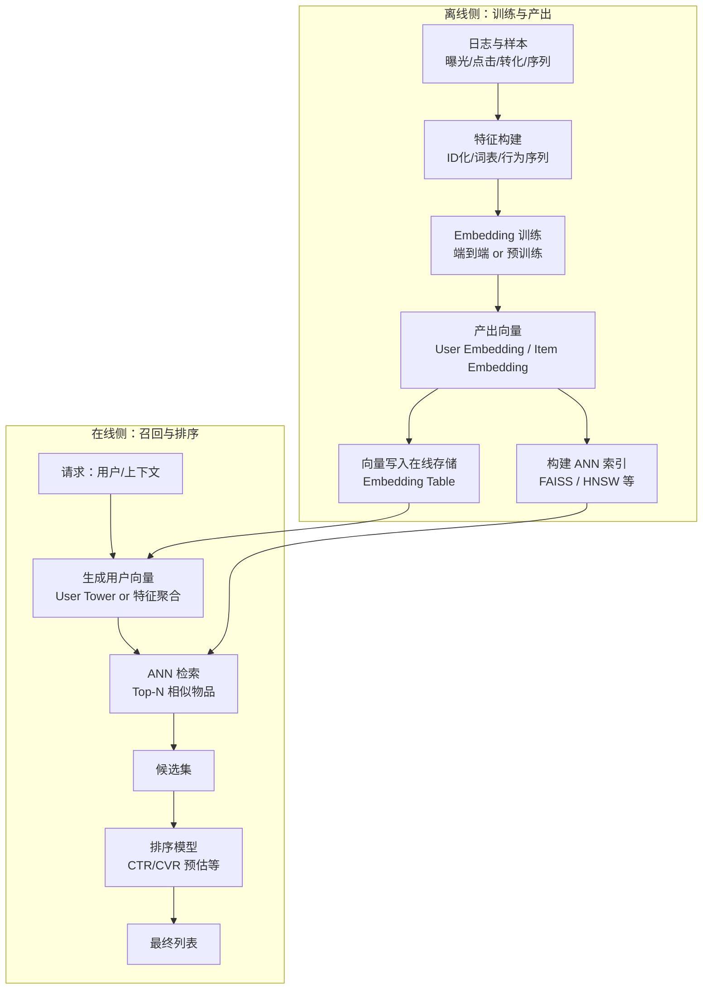

+++
title = "4-核心技术——Embedding在推荐系统中的应用"
date = "2026-01-12T20:00:00+08:00"

tags = ["推荐系统", "Embedding", "召回", "排序", "ANN", "Deep Learning Recommender System 2.0"]
categories = ["搜广推"]
collections = ["Deep Learning Recommender System 2.0"]

draft = false
weight = 4
+++

> [!abstract]+
> Embedding 的本质是把高维稀疏的离散符号，映射到低维稠密的连续向量空间，使“相似”可以通过向量距离或内积被计算。
> 在推荐系统中，它既是深度学习网络的输入层“翻译器”，也是召回层可部署、可索引的核心表示，还是多源信息融合（如属性、上下文、知识图谱）的统一载体。
> 本文以工程可落地为目标，梳理 Embedding 在**特征表示、预训练/端到端训练、双塔召回、近似最近邻检索（ANN, Approximate Nearest Neighbor）** 与线上服务中的关键用法与注意事项。

---

## Embedding 为什么能成为推荐系统的“通用接口”

推荐系统面对的输入大多是离散的：用户ID、物品ID、类目、地域、Query词、行为序列中的 token……它们天然形成**高维稀疏向量**（one-hot 或 multi-hot），而深度神经网络（DNN, Deep Neural Network）更擅长处理**低维稠密向量**。

Embedding 层可以被理解为一个“查找表”（lookup table）：对每个离散ID，直接取出一行向量作为其表示；这与经典 Word2vec（word to vector）将词的 one-hot 映射到词向量的结构一致。换句话说，Embedding 层就是从“稀疏符号空间”到“稠密几何空间”的映射。

> [!note]
> **工程视角的直觉：**
>
> - 离散特征让“等号判断”很容易（ID相等/不等），但让“相似判断”很困难；
> - Embedding 把相似性变成几何问题：用 $u^\top v$ 或 $||u-v||$ 就能衡量相关性；
> - 一旦相似性可计算，召回、粗排、精排的许多模块就能围绕同一套表示协作。

---

## 推荐系统里 Embedding 的三种主流用法

在实践中，Embedding 通常以三种方式出现：作为网络输入层、作为预训练特征、作为召回层相似度。它们不是互斥关系，而是**同一技术在不同阶段的“部署形态”**。

### 作为深度学习网络的 Embedding 层：稀疏到稠密的入口

当模型输入包含大量类别型特征（用户/物品/上下文离散字段）时，Embedding 层把 one-hot 映射为低维向量，然后与数值特征拼接，再进入 MLP/注意力/交叉网络等结构。

端到端训练的优点是梯度可直接回传到 Embedding；但工程上常见问题是 Embedding 参数规模巨大，导致训练与收敛速度受影响。

### 作为预训练 Embedding：先“学表示”，再“学任务”

当业务强调快速迭代、上层模型频繁更新时，会把 Embedding 的学习从主网络中拆出来，先离线预训练稠密表示，再把这些向量作为特征输入上层模型，从而显著减少参与训练的参数量、加快收敛。YouTube 召回模型就是这一思想的典型例子：用户观看历史、搜索词等向量可以来自预训练，然后在召回层得到用户向量并用于线上召回。

### 作为召回层：用户向量 × 物品向量

把用户和物品都投到同一个向量空间后，可以用内积或余弦相似度进行 Top-N 检索：
$$
score(u,i)=\langle \mathbf{e}_u,\mathbf{e}_i\rangle
$$

线上部署时，往往不需要把整个深度网络都搬上去推断；只需要把离线产出的用户/物品 Embedding 存到在线存储中，线上请求时计算内积并取 Top-N，得到召回候选集。

---

## 从“查找表”到“可训练表示”：训练目标与负采样

很多 Embedding 训练可以抽象为：让“正样本对”更近，让“负样本对”更远。以 Word2vec 的思想类比到推荐系统，正样本可以是用户行为序列中的共现（如同一会话、同一窗口内的物品对），负样本则从全局分布采样。

如果直接做全量 softmax，多分类输出维度可能非常大（例如词表或物品集合规模），训练成本难以承受；因此常用负采样（Negative Sampling）把目标从大规模多分类近似为若干次二分类，从而显著降低每步更新的计算量。

一个常见形式是（以“正样本 + K 个负样本”为例）：
$$
\mathcal{L} =
-\log \sigma(\mathbf{v}_{pos}^\top \mathbf{h})
-\sum_{j=1}^{K}\log \sigma(-\mathbf{v}_{neg_j}^\top \mathbf{h})
$$

> [!note]
> 负采样的关键不是“省算力”这么简单：
>
> - 它决定了“什么是难负样本”，进而影响向量空间的几何结构；
> - 它与采样分布、温度、频次截断等策略强相关；
> - 它会改变训练数据的有效权重，需配合评估指标验证收益。

---

## 双塔召回与向量检索：从 O(n) 到 ANN

### 双塔（Two-Tower / Dual Encoder）：把打分拆成“离线建库 + 在线检索”

双塔的核心是把复杂交互网络拆开，让用户塔产出 $\mathbf{e}_u$，物品塔产出 $\mathbf{e}_i$，线上只做轻量计算（内积）：
$$
score(u,i)=\mathbf{e}_u^\top \mathbf{e}_i
$$

这带来一个明确的工程好处：物品向量可离线预计算并“建库”，线上只需为用户生成向量并检索。

### 线上瓶颈：遍历百万候选仍是 $O(n)$

即使只做内积，面对百万级候选集，逐个遍历依然会带来明显延迟；因此召回层通常会引入 **近似最近邻搜索（ANN, Approximate Nearest Neighbor）** 来加速检索。
工程上常用 FAISS（Facebook AI Similarity Search）一类工具提供多种索引结构，在召回率与时延之间做权衡。

---

## 多源信息融合：一个物品不止一个 Embedding

真实业务中，一个物品往往同时具备多类离散信息（类目、品牌、作者、文本、图像、地域、知识图谱实体等），因此可能有多个 Embedding。如何把多个 Embedding 融合为一个“最终物品向量”是核心问题之一。

一种直接方案是平均池化；为了减少简单平均带来的信息损失，可以为不同 Embedding 分配权重，做加权融合（思想上接近注意力）。例如 EGES（Enhanced Graph Embedding with Side information）在融合不同补充信息时，会学习权重并对多路 Embedding 做加权组合，同时要求各路 Embedding 维度一致、并在同一模型中端到端训练以确保处于同一向量空间。

> [!note]
> 融合策略选型可以概括为：
>
> - 信息独立、噪声可控：平均/拼接 + MLP 足够；
> - 信息重要性随上下文变化：加权/注意力更合适；
> - 信息来自图结构/知识图谱：图嵌入或 GNN（Graph Neural Network）往往更自然。

---

## 线上架构：Embedding 如何真正跑在系统里

下面给出一个“离线训练 → 在线服务 → 召回 → 排序”的最小闭环，强调 Embedding 在不同模块中的形态变化。

这套结构与“无需部署完整网络、只存储 Embedding 并通过内积排序获得召回候选”的工程化思路一致：把复杂模型尽量前移到离线，把线上计算压缩到“向量生成 + 快速检索 + 轻量排序”。

---

## 常见工程问题与可操作的检查点

### Embedding 维度与容量

- 维度 $d$ 越大，表达能力越强，但存储与带宽成本线性上升；
- 召回场景下，向量检索的延迟不仅与 $d$ 有关，也与索引结构、量化策略、候选重排有关；
- 当你发现“排序有效但召回拉胯”，先检查向量是否真的处于同一空间（训练方式/融合方式/归一化是否一致）。

### 向量空间一致性

如果不同来源的 Embedding 是分别预训练得到的，它们往往不在同一空间内，直接加权/相似度计算会失真；需要在统一目标下联合训练或做对齐（alignment）。EGES 对“必须在同一模型中端到端训练以保证同空间”的强调，本质上就是这一点。

### 召回的“可解释性”与“可控性”

Embedding 召回很强，但也更“黑盒”。常见做法是为线上策略保留：

- 规则召回/倒排召回作为兜底；
- ANN 召回作为主力；
- 热门/新物品/运营位作为流量调控入口。

---

## 小结

Embedding 在推荐系统中的价值，不是“把 ID 变成向量”这么单一，而是提供了一套统一的、可计算的表示体系，使得：

- 输入侧：高维稀疏特征可以进入深度网络；
- 表达侧：多源信息可以融合为同一语义空间；
- 召回侧：用户与物品的相似性可以通过内积/距离直接检索，并借助 ANN 工程化加速；
- 部署侧：复杂网络可离线化，线上只保留向量与轻量计算，从而满足时延约束。
