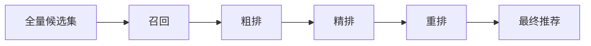

+++
title = "5-推荐架构——深度学习推荐系统的级联架构"
date = "2026-01-20T20:00:00+08:00"
lastmod = "2026-01-23T11:58:51+08:00"

tags = ["推荐系统", "召回", "粗排", "精排", "重排", "TDM", "COLD", "RankNet", "Bandit", "Deep Learning Recommender System 2.0"]
categories = ["搜广推"]
collections = ["Deep Learning Recommender System 2.0"]

draft = false
weight = 5
+++

> [!abstract]+
> 本章围绕“**召回 → 粗排 → 精排 → 重排**”的级联架构展开，回答一个核心问题：
> **如何在计算预算有限的情况下，把复杂模型的推荐效果压到线上可用的时延里**。
> 内容聚焦三点：
>
> * 召回层：从单策略到多路召回，再到 Embedding 召回与 TDM/Deep Retrieval。
> * 粗排层：独立轻量模型 vs LTR 方案，以及 RankNet 等核心方法。
> * 重排层：探索与利用、多样性与业务需求的平衡。

---

## 为什么推荐系统必须“级联”

深度学习模型效果提升的代价是**计算量与时延**。当候选集是百万量级、模型参数上亿时，在线直接全量排序几乎不可用。
因此工程上会把排序过程拆为多层：

* 召回：快，筛出几百个“靠谱”候选
* 粗排：快且准，从几百缩到几十
* 精排：最准，从几十到最终列表
* 重排：融合业务与多样性策略

> [!important]
> 级联的本质是“**在不同层分配不同算力预算**”：越靠后越精，但处理规模越小。

除此之外，级联还能带来更清晰的工程边界：

* **时延预算可控**：不同层设定超时与降级策略
* **特征分层**：实时特征更适合放在靠后层使用
* **迭代速度**：召回/粗排可快速试错，精排保持稳定
* **成本归因**：每一层的算力开销与收益更容易量化

---

## 以快为主的召回层

### 单策略 → 多路召回

单策略召回速度快，但覆盖有限；多路召回把多种策略并行组合，兼顾覆盖与效率：

* 热门/流行
* 兴趣标签
* 协同过滤
* 简单模型（LR、FM 等）

多路召回的问题是**各路评分不可比、候选规模难控**，因此需要更统一的度量。

工程上还需要处理两个细节：

* **候选合并与去重**：多路结果天然有交集，去重与打散影响覆盖与新颖度
* **配额与权重**：给不同召回通道设定配额，避免单一路径吞掉候选集

### Embedding 召回：统一度量与工程落地

Embedding 召回通过用户/物品向量相似度实现统一度量，优势在于：

1) 多路信息可融合进同一向量空间
2) 相似度可比，候选规模可控
3) 可结合 ANN 索引实现快速检索

常见召回方式：

* **U2I**：用户向量 → 物品向量
* **I2I**：用户喜欢的物品 → 相似物品
* **U2U2I**：相似用户 → 他们喜欢的物品

> [!note]
> 稳定性要点：
>
> * **向量空间一致性**：归一化方式、训练目标与相似度度量的对齐
> * **向量更新策略**：离线批量更新 + 在线增量修正的组合
> * **索引维护成本**：候选规模越大，增量更新与重建越关键

### 大厂方案：TDM 与 Deep Retrieval

当 Embedding 召回表达力不足时，业界提出了“模型 + 索引结构”方案：

* **TDM（Tree-based Deep Model）**：用树形索引逐层剪枝，降低搜索复杂度。
* **Deep Retrieval**：用多层索引网络逐层选择路径候选。

它们能提升召回表达力，但工程成本和训练复杂度较高，中小团队通常难以落地。

> [!tip]
> 更多团队会在 Embedding 召回上继续做特征融合与策略组合，而不是直接引入全新的索引结构。

---

## 承上启下的粗排层

粗排层负责**整合多路召回结果，并为精排层筛选候选集**。关键设计点：

1) **速度优先**，模型结构不能太复杂
2) **目标一致**，粗排与精排预测目标应尽量一致

粗排层还有一个常被忽略的作用：**平衡多路召回的分布**。即使召回层已设定配额，粗排仍需要对候选集做二次整合，避免某一路径的特征主导最终候选。

### “独立派” vs “LTR 派”

* **独立派**：粗排是独立排序模型（LR、FM、双塔、Wide&Deep 等）
* **LTR 派**：粗排学习精排的排序结果，追求一致性

LTR 的优点是整体最优，但可能引发“共振效应”：精排失准 → 粗排学偏 → 候选质量下降。

在工程实践中，常见的折中方式是：

* 对 LTR 目标加入一定比例的真实反馈标签
* 在异常时回退到独立派粗排以保证鲁棒性

### LTR 三类方法

* **Pointwise**：把排序当成分类/回归
* **Pairwise**：学习物品对的相对顺序
* **Listwise**：直接优化整个列表

工业上最常用的是 Pointwise（技术栈复用），Pairwise 次之，Listwise 成本最高。

### RankNet 的核心思想

RankNet 用 pairwise 的交叉熵损失来学习排序概率：

$$
P(A>B)=\frac{1}{1+e^{-(s_A-s_B)}}
$$

$$
\mathcal{L}=-y\log P(A>B)-(1-y)\log(1-P(A>B))
$$

---

## 算力与复杂度的较量

### 工程路线代表：COLD

COLD（Computing Power Cost-aware Online and Lightweight Deep pre-ranking）通过工程手段把复杂模型压到粗排层可用：

* **特征筛选**：SE block 选 Top-K 特征
* **低精度训练**：Float32 → Float16
* **多层级并行**：多线程 + GPU
* **行计算 → 列计算**：稀疏特征矩阵化

结论是：COLD 性能接近复杂精排模型，但延迟更低、吞吐更高。

除此之外，粗排层常见的工程优化还包括：

* **特征缓存与热启动**：复用高频用户/物品的中间结果
* **批量推断**：合并请求提高硬件利用率
* **轻量化部署**：将模型拆分为可裁剪、可降级的子模块

### 模型路线代表：知识蒸馏

Teacher-Student 结构让轻量模型学习精排模型的“暗知识”，常用 **KL 散度**约束 logits 分布：

$$
KL(P\|Q)=\sum_i P(i)\log\frac{P(i)}{Q(i)}
$$

> [!important]
> 粗排/召回的知识蒸馏，本质是用精排模型的 logits 作为软标签，逼近精排排序能力。

知识蒸馏的价值在于“目标一致但结构简化”。它不仅适用于召回/粗排，也常用于精排模型的瘦身与加速。

---

## 冲破信息茧房的重排层

重排层的使命是**多样性与业务约束**：探索新兴趣、注入新内容、支持业务策略。

### 探索与利用：三类方法

1. **传统 MAB**：e-Greedy、Thompson Sampling、UCB
2. **个性化探索**：Contextual Bandit（LinUCB）
3. **深度学习重排**：直接建模多样性目标

LinUCB 在 CTR 线性模型下扩展 UCB 思路：

$$
\hat{r}=\theta^\top x,\quad score=\hat{r}+\alpha\sqrt{x^\top A^{-1}x}
$$

### Airbnb 的深度学习重排

Airbnb 用双塔 + pairwise loss 构建重排模型，并把**精排序列 + 查询上下文**压缩成 Query Context Embedding，显著提升 NDCG 与多样性。

> [!tip]
> 关键不在双塔本身，而在“序列级上下文”对候选关系的建模能力。

重排层的另一个前沿方向是**约束式排序**：把多样性、新鲜度、曝光均衡等要求显式写入约束或目标函数，在可解释的规则下做排序优化。这类方法强调“可控性”，特别适合需要快速响应业务策略的场景。

---

## 小结

* 召回层从单策略 → 多路 → Embedding，TDM/Deep Retrieval 追求更强表达力
* 粗排层在“算力限制”与“模型效果”之间演化，COLD 与蒸馏是两条主线
* 重排层解决多样性与业务目标，探索与利用是核心范式

随着算力和架构优化提升，召回/粗排/精排/重排的边界正在被重新定义，未来可能出现更统一的模型架构。
