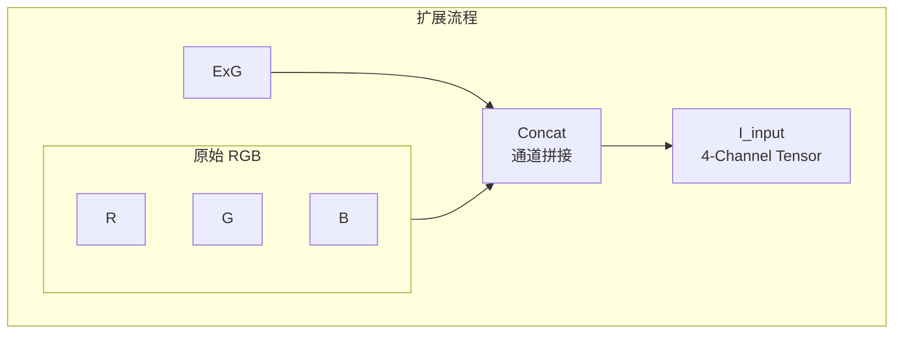

+++
title = "颜色空间与颜色指数：视觉感知与深度学习特征增强"
date = "2025-12-24T14:00:00+08:00"
tags = ["计算机视觉", "颜色空间", "特征工程", "深度学习"]
categories = ["计算机视觉"]
+++

> [!abstract]+
> 本文围绕计算机视觉任务中的颜色信息建模问题，系统梳理了常见颜色空间的表达方式及其工程特性，并重点分析了颜色指数（Color Index）在突出特定颜色特征方面的数学原理。  
> 在此基础上，讨论了将颜色指数显式引入深度学习模型的特征建模思路，说明其在低计算开销、端到端训练与工程部署方面的优势。  
> 文章旨在从视觉感知与工程实践的角度，阐明颜色特征增强在现代视觉系统中的实际价值。

## 颜色信息在视觉建模中的角色

颜色是视觉感知中最基础的低层特征之一，在目标检测、图像分割、实例分割等任务中具有不可替代的作用。  
与纹理、形状等中高层特征相比，颜色信息具有以下特点：

- 直接来源于传感器，获取成本低
- 在局部区域内分布稳定
- 对部分外观相似目标具有较强判别力

在工程实践中，若仅依赖深度网络隐式学习颜色分布，往往会受到光照变化、样本规模与模型容量的限制。因此，**通过显式建模颜色特征，为网络提供可解释的低层先验**，是一种成本极低但收益明显的增强手段。

---

## 常用颜色空间及其特性

### RGB 颜色空间

RGB（Red, Green, Blue）是最常见的颜色表示方式，其通过三种基色的线性组合描述像素颜色。  
设某一像素点的 RGB 分量为 $(R, G, B)$，则其颜色向量可写为：

$$
\mathbf{I}_{RGB} = [R, G, B]^\top
$$

RGB 颜色空间的主要优点在于：

- 与成像传感器机制一致
- 表示方式简单、计算友好
- 深度学习框架原生支持

但其缺点同样明显：

- 三个通道之间相关性较强
- 亮度与颜色信息高度耦合
- 对光照变化较为敏感

在复杂场景下，单纯依赖 RGB 往往难以获得稳定的颜色判别能力。

---

### 感知型颜色空间

为缓解 RGB 空间的耦合问题，研究者提出了多种颜色空间变换方式，例如：

- **HSV**：将颜色分解为色调、饱和度与亮度
- **Lab（CIELAB）**：通过非线性映射逼近人眼感知特性

这些颜色空间在传统视觉算法中被广泛使用，但在深度学习工程中存在一些现实问题：

- 额外的颜色空间转换开销
- 数值分布与梯度特性不一定适合端到端训练
- 与现有网络结构的兼容性有限

因此，在对实时性和系统复杂度有要求的场景中，直接基于 RGB 构造增强特征，往往更加实用。

---

## 颜色指数的基本原理

颜色指数（Color Index）是一类通过对 RGB 各通道进行线性或非线性组合，以突出特定颜色响应的特征表示方法。  
其核心思想是：

> [!important]
> **放大目标在某一颜色通道上的优势，同时抑制其他通道及背景干扰。**

一般形式可表示为：

$$
CI = f(R, G, B)
$$

其中 $f(\cdot)$ 通常为简单的线性组合或归一化函数。

---

### 常见颜色指数示例

以线性组合形式为例，可定义以下典型颜色指数：

#### 超绿指数（Excess Green, ExG）

$$
\text{ExG} = 2G - R - B
$$

该指数通过提升绿色通道权重、抑制红蓝通道，使绿色区域在数值空间中更加突出。

#### 超红指数（Excess Red, ExR）

$$
\text{ExR} = 2R - G - B
$$

#### 超蓝指数（Excess Blue, ExB）

$$
\text{ExB} = 2B - R - G
$$

这类颜色指数计算形式极为简单，但在颜色分布相对稳定的条件下，能够显著增强目标区域的对比度。

---

### 工程视角下的优势

从工程实现角度看，颜色指数具有明显优势：

- 仅包含逐像素算术运算，计算成本极低
- 不改变图像空间结构
- 易于并入现有数据管线或网络前向过程
- 具备良好的可解释性

这使得颜色指数成为一种**非常适合与深度模型结合的轻量级特征增强手段**。

---

## 颜色指数与深度学习特征建模的结合

在标准的 CNN 或 Transformer 视觉模型中，颜色信息通常是被隐式编码的。  
但在以下场景中，仅依赖隐式学习往往效果有限：

- 目标结构相似、颜色差异明显
- 输入分辨率较低，纹理信息不足
- 模型规模受限，表达能力有限

此时，将颜色指数显式引入模型，有助于引导网络关注颜色显著区域。

---

### 多通道输入方式

以 $ \text{ExG} $ 为例一种常见做法是将颜色指数作为额外通道，与原始 RGB 图像进行拼接：

$$
\mathbf{I}_{\text{input}} = [R, G, B, \text{ExG}]^\top
$$

---

该方式具备以下特点：

- 不破坏原始空间结构
- 与现有卷积网络高度兼容
- 适合端到端训练
- 对推理延迟影响极小

相较于直接切换颜色空间，这种方式在工程上更加稳定、可控。

---

### 与通道注意力机制的协同

在多通道输入的基础上，引入通道注意力机制可以进一步提升特征利用效率：

- 自适应调节 RGB 与颜色指数通道权重
- 抑制光照变化引入的噪声
- 强化颜色指数在复杂背景下的贡献

这种**显式颜色建模 + 隐式特征选择**的组合，在轻量化网络设计中尤为有效。

---

## 小结

> [!note] 总结  
> 从计算机视觉与工程实现的角度来看，颜色指数是一种：
> **结构简单、计算高效、易于集成且具备明确物理含义的特征增强手段。**

相较于复杂颜色空间变换，颜色指数：

- **更适合实时系统**
- **更利于端到端训练**
- **更容易与现代深度学习模型融合**

在实际视觉系统设计中，颜色指数可以作为一种低成本但高收益的补充特征，为模型提供稳定、可解释的颜色先验。
