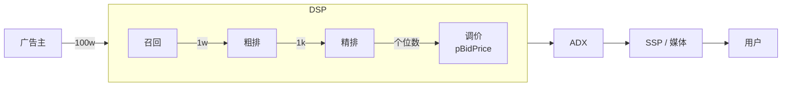

+++
title = "广告投放流程：召回、粗排、精排与调价"
date = "2026-01-03T16:00:00+08:00"
tags = ["广告系统", "推荐系统"]
categories = ["搜广推"]
+++

> [!abstract]+
> 在大规模在线广告系统中，一次广告曝光往往需要在毫秒级时延约束下完成多阶段决策。面对百万级广告候选规模与高并发用户请求，广告平台难以直接对全量广告应用复杂模型进行精细评估，因此形成了以**召回、粗排、精排与调价**为核心的工程化投放链路。该流程通过逐级缩小候选集规模、逐级提升模型复杂度与计算精度，在系统性能与投放效果之间取得平衡，已成为广告系统与推荐系统中被长期验证的核心工程范式。

---

## 广告投放整体流程概览

在 **DSP / 广告平台内部**，广告选择与排序一般遵循上述四阶段流程，以在效果、成本与延迟之间取得工程最优解。

---

## 召回阶段（Recall）

### 阶段目标

召回阶段的核心目标是：

**从海量广告中，快速找出“可能相关”的一小部分广告，确保不漏掉潜在高价值候选。**

该阶段以**高召回率**为第一优先级，对精度要求相对宽松。

### 核心任务

* 基于用户基础属性

  * 地理位置
  * 设备类型
  * 兴趣 / 行为标签

* 基于广告基础约束

  * 定向条件
  * 投放状态
  * 预算与频控

* 基于规则系统或倒排索引进行快速匹配

### 候选规模变化

* 输入规模：约 **100 万级广告**
* 输出规模：约 **1 万广告**

### 工程特征

* 极低延迟（通常 < 1 ms）
* 高并发、高吞吐
* 多路召回、规则驱动
* 宁可多召回，不轻易错杀潜力广告

---

## 粗排阶段（Coarse Filtering）

### 阶段目标

粗排阶段关注的是：

**在保证整体效果基本稳定的前提下，显著缩小候选集规模，降低后续精排的计算压力。**

这是一个**效率优先**的阶段。

### 核心任务

* 使用轻量级模型对广告进行快速打分
* 初步区分“明显不优”的广告
* 保留具备竞争力的候选

### 候选规模变化

* 输入规模：约 **1 万广告**
* 输出规模：约 **1 千广告**

### 常见方法

* 线性回归（LR）
* 浅层 MLP
* 裁剪后的 GBDT / 决策树
* 有限特征交叉

### 工程权衡

* 单广告预测延迟要求极低
* 模型结构简单、可高度并行
* 更关注排序趋势而非绝对精度

---

## 精排阶段（Fine-Grained Sorting）

### 阶段目标

精排阶段是广告系统中**最核心、最复杂、效果贡献最大的阶段**，目标是：

**在有限候选中，尽可能准确地评估广告效果并生成最终排序。**

### 核心任务

* 精确预测广告效果指标

  * 点击率 **pCTR**
  * 转化率 **pCVR**

* 深度建模

  * 用户特征 × 广告特征
  * 历史行为 × 当前上下文

### 候选规模变化

* 输入规模：约 **1 千广告**
* 输出规模：**个位数 / 十位数广告**

### 常见方法

* 深度神经网络（DNN）
* Wide & Deep
* DeepFM / xDeepFM
* Attention / Transformer 结构

### 工程特征

* 模型复杂度最高
* 特征交叉最充分
* 对整体延迟极其敏感
* 是系统效果的决定性因素

---

## 调价阶段（Bid Price Adjustment）

### 阶段目标

调价阶段解决的问题是：

**在已排序广告基础上，结合广告主出价与预估效果，计算最终竞价价格。**

即确定广告的最终竞争力。

### 核心任务

* 综合考虑

  * 预估 **pCTR**
  * 预估 **pCVR**
  * 广告主出价与预算
  * 平台商业目标

* 计算最终竞价价格 **pBidPrice**

### 常见计算形式

基于点击收益的 eCPM 形式：

$$
eCPM = Bid \times pCTR \times 1000
$$

考虑转化价值的扩展形式：

$$
Score = Bid \times pCTR \times pCVR \times Value
$$

### 工程特点

* 强实时性
* 强策略驱动
* 与平台收益和广告主 ROI 高度绑定

---

## 整体流程总结

从工程视角看，四个阶段形成了清晰而稳定的职责划分：

* **召回**：解决“有哪些广告可以考虑”
* **粗排**：解决“哪些广告不值得深度计算”
* **精排**：解决“哪些广告最值得展示”
* **调价**：解决“以什么价格展示最合适”

该分层结构在效果、性能与系统复杂度之间取得了良好平衡，是现代广告系统长期演进的核心基础。

---

> [!note] 总结
广告投放流程本质上是一个**大规模排序与决策问题**。
通过“召回—粗排—精排—调价”的逐级收敛结构，系统能够在极短时间内完成高质量决策。这一范式不仅适用于广告系统，也广泛存在于推荐系统、搜索系统等工业级场景中，并将在未来很长一段时间内持续演进与优化。
