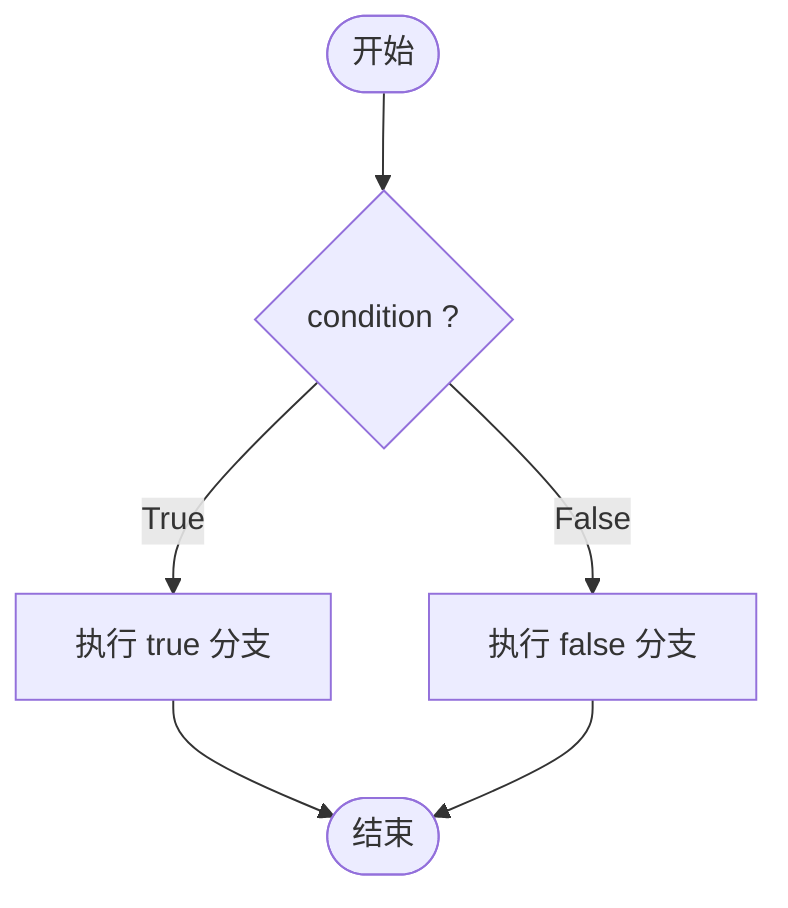

+++
title = "深入理解 C++ 中的 if 语句"
date = "2025-12-25T12:00:00+08:00"
tags = ["cpp", "if"]
categories = ["cpp"]
+++

> [!abstract]+
> 本文系统介绍了 C++ 中最核心的条件控制语句 —— `if`。重点参考了 [**cppreference**](<https://en.cppreference.com/w/cpp/language/if.html> "if statement - cppreference") 上关于 `if` 语句的规范定义，从**基本语法**、**`condition`的类别**、**带初始化语句**、**`constexpr if`** 以及 **`if consteval`** 四个角度进行详尽讲解。

---

## 什么是 `if` 语句

在 C++ 中，`if` 语句用于根据条件动态选择执行路径，是程序控制流中最常用的分支结构。它会根据给定的条件判断结果决定执行哪个代码块。标准定义中指出，`if` 语句**有多种语法形式**，包括带或不带 `else` 分支、支持初始化语句、支持 `constexpr if` 和 `if consteval` 等。



最基础的写法如下：

```cpp
if (condition) {
    // 条件为 true 时执行
} else {
    // 条件为 false 时执行（可选）
}
```

---

## `condition` 究竟是什么？

在标准语义里，一个 `if` 的条件部分 —— 即 `condition` —— 可以是下面任意一种：

> [!important]
>
> * 一个 **表达式（expression）**
> * 一个 **声明（declaration）**

这意味着：`if` 的判断并不局限于简单的布尔表达式，还可以在条件中声明并初始化变量。

---

## 情况 1：条件是表达式

最常见也是传统的 `if` 用法是条件表达式。这类条件表达式会**求值，然后上下文转换为 bool 类型**，再决定执行哪个分支：

```cpp
int x = get_value();
if (x > 0) {
    std::cout << "positive\n";
}
```

这里 `x > 0` 就是一个表达式，它经过转换为布尔值后参与判断。

---

## 情况 2：条件是声明

除了表达式，C++ 标准允许在条件部分使用**声明语句**。声明语句必须是可以**转换为 bool** 的简单声明（通常是带初始化的变量声明）。这种写法在模板代码和需要局部变量的判断逻辑中非常有用。

例如：

```cpp
if (Derived* p = dynamic_cast<Derived*>(base_ptr)) {
    p->doSomething();
}
```

上述代码中：

* `Derived* p = dynamic_cast<Derived*>(base_ptr)` 是一个声明；
* 如果声明出的指针 `p` 非空，则执行大括号内代码；
* 声明的变量 `p` 只在这个 `if` 块的作用域内有效。

这一行为是标准允许的 “condition is a declaration” 语义，它等价于先声明变量再做判断，但作用域被限制在 `if` 块内，从而提升代码安全性与清晰度。

---

## 带初始化语句的条件（C++17+）

从 C++17 起，`if` 语句支持在条件前添加一个**初始化语句**，其结构如下：

```cpp
if (init-statement; condition) {
    ...
}
```

`init-statement` 可以是**一个表达式语句**，也可以是一个**声明**。这种写法的好处包括：

* 变量作用域仅限于 `if` / `else` 内；
* 避免污染外部作用域；
* 初始化逻辑与判断逻辑集中到同一处。

例如：

```cpp
if (int result = compute(); result > threshold) {
    // 在此块内使用 result
} else {
    // 在 else 块内也可以访问 result
}
// 出了 if / else 块 result 不再有效
```

因为 `init-statement` 是先执行，再计算条件表达式，它可以用来初始化临时变量并立即参与判断。

---

## `constexpr if`

C++17 引入了 `constexpr if`，用于**编译期判断条件并根据模板参数选择不同实现**：

```cpp
template <typename T>
void f(T t) {
    if constexpr (std::is_integral_v<T>) {
        // 整型处理
    } else {
        // 其他类型处理
    }
}
```

这里的条件必须是**可在编译期求值的常量布尔表达式**。`constexpr if` 会在**编译阶段舍弃不满足的分支**，从而避免无效代码实例化，提高泛型代码的安全性与效率。

---

## `if consteval`（C++23）

C++23 新增了 **`if consteval`** 语法，用于在函数体内判断当前的求值上下文是否是**常量求值上下文**。它与 `constexpr if` 不同：

* `constexpr if` 是对编译期常量条件的静态分支选择；
* `if consteval` 是 **在运行时或编译期调用同一个函数时区分执行路径**。

`if consteval` 的基本语法如下：

```cpp
if consteval {
    // 仅当此代码在常量求值上下文执行时被选中
} else {
    // 否则在普通（运行时）上下文执行
}
```

例子：

```cpp
constexpr int f(int x) {
    if consteval {
        // 常量求值时走这里
        return x * 2;
    } else {
        // 运行时求值走这里
        return x;
    }
}
```

与传统的判断（例如 `std::is_constant_evaluated()`）相比，`if consteval` 可以更直接区分求值上下文，并且在语法层面更明确。

还可以使用否定形式 `if not consteval` 来表示反向条件。

---

## 示例整理

### 传统表达式条件

```cpp
if (ptr != nullptr) {
    use(ptr);
}
```

### 声明作为条件

```cpp
if (auto it = container.find(key); it != container.end()) {
    process(*it); // it 只在这里有效
}
```

### 带初始化语句

```cpp
if (int score = getScore(); score >= 60) {
    std::cout << "Pass\n";
} else {
    std::cout << "Fail\n";
}
```

### `constexpr if`

```cpp
template <typename T>
void f(T t) {
    if constexpr (std::is_floating_point_v<T>) {
        // floating point
    } else {
        // other types
    }
}
```

### `if consteval`

```cpp
constexpr int compute(int x) {
    if consteval {
        return x * x; // 编译时求值路径
    } else {
        return x;     // 运行时路径
    }
}
```

---

## 小结

下面是关于 `if` 语句中 `condition` 的核心要点：

> [!important]
>
> * **条件表达式** 会求值再转换为布尔；
> * **声明条件** 允许在条件中定义变量并作为判断依据；
> * **带初始化语句** 是 C++17 的增强写法，可将变量作用域局限；
> * **`constexpr if`** 支持编译期分支选择；
> * **`if consteval`** 支持根据当前求值上下文区分执行路径。
