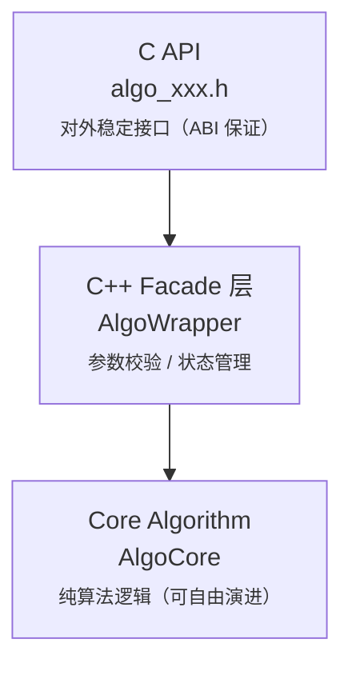

+++
title = "通用算法模块文档模板（C++ / C API）"
date = "2025-12-26T10:00:00+08:00"
tags = ["cpp", "文档"]
categories = ["cpp"]
+++

> [!abstract]+
> 本文整理并沉淀了一套 **通用算法模块文档模板**，用于描述以 **C++ 实现核心算法、并通过稳定 C API 对外提供能力** 的工程化算法组件。  
> 模板强调 **接口稳定性、生命周期管理、内存与线程模型、能力边界与工程约束**，适用于算法库、推理模块、嵌入式系统及跨语言 FFI 场景。  
> 该模板可作为个人或团队在长期算法工程实践中的统一文档规范。

---

## XXX Algorithm Module

> C++ 核心算法实现 + 稳定 C API 对外接口

---

## 模块概述（Overview）

本模块实现了一个用于【填写算法目标，例如：多目标跟踪 / 目标检测 / 状态估计】的算法组件。  
核心算法逻辑采用 C++ 实现，并通过 **稳定的 C API** 对外提供调用接口，便于在 C / C++ / Rust / Python（FFI）等环境中集成。

### 适用场景

- 场景 1：……
- 场景 2：……
- 场景 3：……

### 设计目标

- 算法逻辑与接口解耦
- 对外 ABI 稳定
- 支持多实例、可控生命周期
- 便于嵌入式 / 推理系统 / 后端服务集成

---

## 功能说明与能力边界

### 已支持功能

- [x] 功能 A
- [x] 功能 B
- [x] 功能 C

### 非目标 / 限制说明

- ❌ 不支持……
- ❌ 不保证……
- ⚠️ 假设输入满足……

> ⚠️ 本模块 **只负责算法本身**，不负责数据采集、预处理或结果可视化。

---

## 算法输入输出语义

### 输入说明

| 名称 | 类型 | 语义说明 | 约束 |
| ---- | ---- | -------- | ---- |
| input_a | float* | xxx | 非空，长度 >= N |
| input_b | int | xxx | 范围 [0, 100] |

### 输出说明

| 名称 | 类型 | 语义说明 | 备注 |
| ---- | ---- | -------- | ---- |
| output_a | struct* | xxx | 调用方负责释放 |
| output_b | int | 状态码 | 0 表示成功 |

---

## 模块整体架构



### 稳定性约定

- ✅ **C API：语义 & ABI 向后兼容**
- ⚠️ C++ 内部实现：不保证接口稳定
- ❌ 禁止在 C API 中暴露 C++ 类型

---

## 生命周期与线程模型

### 生命周期

```text
create → init → process → destroy
```

### 生命周期说明

- `create`：创建算法实例，不分配重资源
- `init`：加载配置，初始化内部状态
- `process`：主算法调用接口
- `destroy`：释放所有资源

### 线程安全说明

- 是否线程安全：☐ 是 / ☑ 否
- 是否支持多实例：☑ 是
- 是否允许并发调用同一实例：☐ 否

> ⚠️ 同一实例禁止跨线程并发调用

---

## C API 使用指南

### 头文件

```c
#include "algo_xxx.h"
```

### 基本使用示例

```c
algo_handle_t handle = algo_create();
if (!handle) {
    return -1;
}

algo_config_t cfg = {
    // 参数填写
};

if (algo_init(handle, &cfg) != 0) {
    algo_destroy(handle);
    return -1;
}

algo_output_t output;
int ret = algo_process(handle, input, &output);
if (ret == 0) {
    // 使用 output
}

algo_destroy(handle);
```

---

## 内存管理约定（非常重要）

- 明确 **由谁分配**
- 明确 **由谁释放**
- 是否支持复用 / 池化

| 对象 | 分配方 | 释放方 |
| - | - | - |
| algo_handle_t | 模块内部 | algo_destroy |
| output buffer | 模块内部 | algo_release_output |

---

## 错误码说明

| 错误码 | 含义 | 可能原因 |
| - | - | ------- |
| 0 | 成功 | - |
| -1 | 参数错误 | NULL 指针 |
| -2 | 状态错误 | 未初始化 |
| -3 | 内部错误 | 内存不足 |

---

## 构建与集成方式

### 构建依赖

- CMake >= 3.16
- C++ 标准：C++17
- 编译器：GCC / Clang / MSVC

### 构建示例

```bash
mkdir build && cd build
cmake ..
make
```

### 产物说明

- `libalgo_xxx.so / .dll`
- `algo_xxx.h`

---

## 性能说明

### 理论复杂度

- 时间复杂度：$O(...)$
- 空间复杂度：$O(...)$

### 实测性能（示例）

| 平台 | 输入规模 | 单次耗时 |
| - | ----- | ------ |
| x86_64 | 1080p | 1.2 ms |
| ARM | 720p | 2.8 ms |

---

## 扩展点与维护说明

### 可扩展方向

- 支持 xxx
- 替换 xxx 模块

### 已知问题 / 注意事项

- xxx 参数对结果极其敏感
- xxx 必须先调用 init

---

## 版本记录（可选）

| 版本 | 说明 | 日期 |
| - | - | - |
| v1.0.0 | 初始版本 | yyyy-mm-dd |
