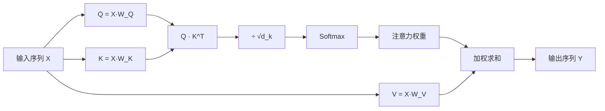

+++
title = "自注意力(Self-Attention)机制的学习与理解"
date = "2025-12-20T03:30:00+08:00"
tags = ["Transformer", "Self-Attention", "深度学习", "NLP"]
categories = ["深度学习"]
+++



## 一、为什么需要自注意力机制

在序列建模任务中（如 NLP、时间序列、视觉 Transformer），我们往往希望模型能够：

- 感知序列中不同位置之间的依赖关系  
- 不再局限于固定窗口或单向传播  
- 在一次计算中建模全局信息  

自注意力（Self-Attention）正是为此而生：

> **序列中的每一个元素，都可以“关注”同一序列中其他所有元素，并动态决定关注强度。**

---

## 二、自注意力的核心思想

设输入是一个长度为 $ n $ 的序列，每个元素是一个 $ d $ 维向量：

$$
X = [x_1, x_2, \dots, x_n], \quad x_i \in \mathbb{R}^d
$$

自注意力的核心做法是：

> 将这 $ n $ 个向量分别映射到三个**不同的语义空间**：
>
> - Query（查询）
> - Key（键）
> - Value（值）

并通过 **Query 与 Key 的相关性** 来决定 **Value 的加权方式**。

---

## 三、Q / K / V 的线性映射

首先，对输入做三次独立的线性变换：

$$
Q = X W_Q,\quad K = X W_K,\quad V = X W_V
$$

其中：

$$
W_Q \in \mathbb{R}^{d \times d_k},\quad
W_K \in \mathbb{R}^{d \times d_k},\quad
W_V \in \mathbb{R}^{d \times d_v}
$$

这样，每个输入向量 $ x_i $ 都被映射为：

- 查询向量：$ q_i $
- 键向量：$ k_i $
- 值向量：$ v_i $

**语义理解：**

- **Query**：我在找什么？
- **Key**：我能提供什么？
- **Value**：真正要汇聚的信息内容

---

## 四、相关性建模：Query · Key

对于序列中的第 $ i $ 个元素，它会与所有元素（包括自己）计算相关性：

$$
\text{score}_{ij} = q_i \cdot k_j
$$

从矩阵角度来看：

$$
\text{Scores} = QK^\top \in \mathbb{R}^{n \times n}
$$

为了缓解维度增大带来的数值不稳定，引入缩放因子：

$$
\text{Scores} = \frac{QK^\top}{\sqrt{d_k}}
$$

---

## 五、Softmax：将相关性变为注意力权重

对每一行进行 softmax 归一化，得到注意力权重：

$$
\alpha_{ij} =
\frac{\exp(\text{score}_{ij})}
{\sum_{j=1}^{n} \exp(\text{score}_{ij})}
$$

此时：

- 每一行权重之和为 1  
- 表示 **第 $ i $ 个 token 对序列中所有 token 的关注分布**

---

## 六、对 Value 加权求和，得到输出表示

最终的自注意力输出可以写为：

$$
\text{Output} =
\text{softmax}\!\left(\frac{QK^\top}{\sqrt{d_k}}\right)V
$$

从单个位置 $ i $ 的角度来看：

$$
y_i = \sum_{j=1}^{n} \alpha_{ij} v_j
$$

**直观含义：**

> 输出向量 $ y_i $ 是对所有 Value 的加权和，  
> 权重由 Query–Key 的相关性动态决定。

因此，自注意力会生成 $ n $ 个新的输出向量：

- 每一个都融合了全局上下文  
- 但关注重点各不相同  

---

## 七、自注意力整体流程示意

---

## 八、从线性代数视角理解自注意力

从计算结构上看，自注意力本质上是三步矩阵运算：

1. **构造相似度矩阵**
   $$
   QK^\top
   $$

2. **行级归一化，得到概率分布**
   $$
   \text{softmax}
   $$

3. **基于概率的线性组合**
   $$
   \text{Attention} \cdot V
   $$

这种形式使得自注意力：

- 完全并行化
- 端到端可微
- 不依赖显式的时序结构

---

## 九、小结

对自注意力机制的核心理解可以概括为：

> **将输入映射到 Query / Key / Value 三个语义空间，
> 通过 Query–Key 的内积建模元素间关系，
> 再对 Value 做加权求和，
> 得到融合全局上下文信息的输出表示。**

其优雅之处在于：

- 关系是 **动态学习的**
- 权重是 **内容相关的**
- 表达是 **全局而非局部的**

这正是 Transformer 以及后续大模型架构能够成功的关键原因之一。
